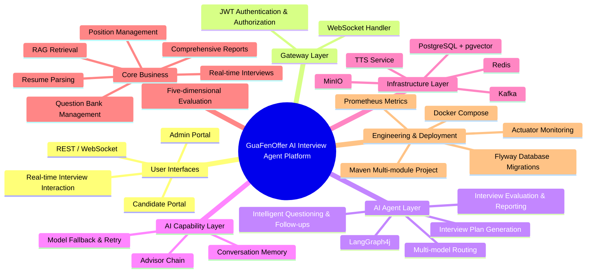

<p align="center">
  <a href="README.md">中文</a> · <a href="README.en.md">English</a>
</p>

<p align="center">
  
</p>

<p align="center">
  <b style="font-size:32px">GuaFen Offer · AI Interview Agent Platform</b>
</p>

<p align="center">
  <i>Spring Boot + Spring AI + LangGraph4j · AI Interview Agent Platform</i>
</p>

<p align="center">
  <a href="#features">Features</a> ·
  <a href="#tech-stack">Tech Stack</a> ·
  <a href="#quick-start">Quick Start</a> ·
  <a href="#core-workflow--architecture">Architecture</a> ·
  <a href="#api">API</a>
</p>

---

An AI interview-agent service platform built with Spring Boot 3.5 + Spring AI 1.1 + Java 21 virtual threads + LangGraph4j. It covers position / question-bank / resume management, RAG semantic retrieval, AI resume parsing, real-time interview Q&A (dynamic follow-up questions, interviewer persona, TTS voice playback, disconnect recovery), and five-dimension evaluation with report generation.



## Features

| Module | Description |
| ---- | ---- |
| Position / Question Bank / Resume Management | CRUD + vectorization (pgvector semantic index). Batch import of question bank and interview-note import (AI structured question extraction). Resume upload (PDF/TXT) with AI structured parsing (work/project experience split); manual correction auto-invalidates old vectors and re-vectorizes |
| RAG Semantic Retrieval | pgvector (halfvec + HNSW index) similarity retrieval for question bank and resumes, with category/difficulty filtering, minimum similarity threshold, and candidate-specific matching; interview plan generation auto-searches the reference question bank using the position JD. Two-layer Redis cache for retrieval results and query embeddings (falls back to direct queries on Redis errors) |
| Full Interview Flow | Plan generation (configurable question count / difficulty) → WebSocket real-time Q&A (streamed output) → dynamic follow-up (up to 3 per main question; clarification / digging / guidance types) → disconnect recovery (Redis Checkpoint + session snapshot) |
| Interviewer Persona | Gentle / stress / deep-tech styles, linkable to TTS voice |
| TTS Voice Playback | Volcano Engine Doubao TTS 2.0, async synthesis after question generation, frontend audio playback (optional toggle) |
| Five-Dimension Evaluation & Report | Professional Competence / Logical Thinking / Communication / Job Fit / Learning & Potential. Round-by-round AI scoring + comprehensive report + hiring recommendation, processed asynchronously via Kafka |
| Resume Authenticity Check | Cross-checks resume work experience against candidate answers during and after the interview, highlighting "possibly unmentioned / conflicting" experiences to help detect resume fraud (conflict details written into the report) |
| Interview Anti-cheating | Optional when generating the candidate link: tab-switch detection (tab/window focus loss) + gaze detection (MediaPipe local WASM face/gaze deviation, frames never leave the browser). Realtime console panel + focus reference on report page |
| Multi-Model Routing | FLAGSHIP / STANDARD / ECONOMY / EMBEDDING tiers with automatic model fallback on failure, exponential backoff retry, and token / latency / cost metrics |
| Centralized Configuration | Both AI model routing and TTS support DB-overriding-yml with runtime config changes taking effect immediately (no restart). TTS API key encrypted in DB and masked in UI (DB incremental override + yml fallback) |
| Auth & Security | JWT + RefreshToken rotation, role-based API permissions (e.g., full re-vectorization is ADMIN-only) |

## Tech Stack

| Layer | Choice |
| ---- | ---- |
| Language | Java 21 (virtual threads) |
| Framework | Spring Boot 3.5.3 / Spring AI 1.1.2 / LangGraph4j 1.8.22 |
| Agent Orchestration | StateGraph (7 nodes, 2 conditional edges) + Redis Checkpointer (interruptBefore(ANSWER)), feature-flag fallback to the legacy imperative pipeline |
| AI Models | Qwen (DashScope) / DeepSeek via OpenAI-compatible mode; four-tier routing + fallback degradation |
| Database | PostgreSQL 16 + pgvector (halfvec 2048-dim, HNSW + pg\_trgm hybrid retrieval index) |
| Persistence | MyBatis-Plus 3.5.12 + Flyway 11.7 (versioned DDL) |
| Cache | Redis 7 (session memory, Checkpoint, RefreshToken, rolling summary, session lock) |
| Messaging | Kafka 3.8 (KRaft mode, no ZooKeeper; async evaluation/report pipeline) |
| Object Storage | MinIO (resume originals, TTS audio, reports) |
| Voice | Volcano Engine Doubao TTS 2.0 (optional) |
| Document Extraction | Apache PDFBox 3.0 (resume PDF text extraction) |
| API Docs | springdoc-openapi (Swagger UI) |
| Code Formatting | Spotless + Google Java Format |
| Security | Spring Security 6 + JWT (jjwt 0.12.6) + BCrypt |
| Frontend | React 19 + TypeScript + Vite 6 + Tailwind CSS 3.4 + TanStack Query + zustand |
| Observability | Actuator / Micrometer (node latency, model latency, cost) / Prometheus endpoint |

## Module Structure

```
ai-ms/
├── interview-core        # Core layer: domain models, unified response envelope, error codes, exception system, paging params (framework-free)
├── interview-ai          # AI layer: multi-model routing (ModelRouter/ModelTier), ChatClient wrapper (AiChatFacade), Advs, Redis conversation memory
├── interview-agent       # Agent orchestration layer: Interviewer/FollowUp/Evaluator/Report/Summary Agent + LangGraph4j graph (nodes/state/checkpoint/observability)
├── interview-infra       # Infrastructure layer: persistence (Entity/Mapper/Service), pgvector RAG, Kafka messaging, MinIO, TTS, Flyway, health checks
├── interview-gateway     # Gateway layer: Spring Boot entry, REST Controllers, interview WebSocket Handler, InterviewWorkflowEngine, JWT security, Kafka consumers
├── frontend/             # Frontend (React 19 + TypeScript + Vite 6 + Tailwind CSS)
├── docker/               # Docker Compose infrastructure + init scripts
├── scripts/              # Data cleanup scripts (by business domain)
├── pom.xml               # Parent POM (version locking + dependency management)
└── .env.example          # Application environment variable template
```

Dependency direction: `gateway -> agent -> ai -> core`, `gateway -> infra -> ai -> core`

## Prerequisites

- **JDK 21+** (recommend Eclipse Temurin 21)
- **Maven 3.9+**
- **Docker** + Docker Compose (for local infrastructure)
- At least one AI model API key (DashScope or DeepSeek)
- **Node.js + pnpm** (frontend development)

## Quick Start

### 1. Start local infrastructure

```powershell
# Windows PowerShell
cd docker
docker compose up -d
```

If `docker/.env` does not exist, run this from the repository root first:

```powershell
Copy-Item .env.example docker/.env
```

Then run `docker compose up -d` to start the following services:

| Service                    | Container port | Host port   | Description                       |
| -------------------------- | ----------- | ----------- | ------------------------------- |
| PostgreSQL 16 (pgvector)   | 5432        | 15432       | Database + vector extension     |
| Redis 7                    | 6379        | 16379       | Cache                           |
| Kafka 3.8 (KRaft)          | 9092        | 9092        | Messaging (2 topics pre-created) |
| MinIO                      | 9000 / 9001 | 9000 / 9001 | Object storage (3 buckets pre-created) |

> Host ports align with `application-local.yml` defaults to avoid conflicts with locally installed services.

```powershell
docker compose ps      # show container status
docker compose logs -f # show logs
docker compose down    # stop containers
docker compose down -v --remove-orphans # stop and delete all data volumes (use with caution)
```

### 2. Configure API keys

```powershell
cp .env.example .env
```

Edit `.env` and fill in real API keys:

```properties
DASHSCOPE_API_KEY=sk-your-dashscope-key
DEEPSEEK_API_KEY=sk-your-deepseek-key
```

> The application checks on startup whether API keys are configured and fails fast if missing.

### 3. Build & run

```powershell
# Build all modules
mvn clean install -DskipTests

# Start the backend
mvn -pl interview-gateway spring-boot:run

# Start the frontend dev server (separate terminal)
cd frontend
pnpm install
pnpm dev
```

After start, visit:

- Backend API: <http://localhost:8080>
- Swagger UI: <http://localhost:8080/swagger-ui.html>
- Health check: <http://localhost:8080/actuator/health>
- Frontend: <http://localhost:5173>
- Default account: admin / admin123 (auto-created on first launch by AdminUserInitializer)

## Core Workflow & Architecture

### Interview state machine

```
CREATED → PLANNING → IN_PROGRESS ⇄ PAUSED → EVALUATING → REPORTING → COMPLETED
                        └──────────────→ CANCELLED / FAILED
```

- When an interview ends (REST `/finish` or WebSocket `FINISH`) it enters `EVALUATING`: Kafka asynchronously scores each round on five dimensions → `REPORTING` generates the comprehensive report → `COMPLETED` (frontend polls every 2s).
- On disconnect, `IN_PROGRESS` atomically transitions to `PAUSED`; after reconnection it resumes from the checkpoint / session snapshot.

### WebSocket real-time Q&A

- Endpoint: `/ws/interview/{sessionId}?token={accessToken}` (JWT validated on handshake; only one active connection per session).
- **Client messages**: `ANSWER` (idempotent, prevents duplicate submissions), `HEARTBEAT` (30s keepalive), `PAUSE`, `FINISH`, `CANCEL`.
- **Server messages**: `SESSION_READY`, `QUESTION_START`, `QUESTION_CHUNK` (streamed chunks), `QUESTION_END`, `ANSWER_ACK`, `AUDIO_READY` (TTS audio ready), `STATUS`, `HEARTBEAT_ACK`, `SESSION_COMPLETED`, `ERROR`.

### Model tiers

| Tier | Default model | Purpose | Degradation strategy |
| ---- | ---------- | ------------ | ------------------ |
| `FLAGSHIP` | qwen-max | High-quality interview dialogue | fallback -> deepseek-chat |
| `STANDARD` | deepseek-chat | Follow-up decisions / evaluation scoring / planning / reports | no fallback |
| `ECONOMY` | qwen-turbo | Summaries / low-cost tasks | no fallback |
| `EMBEDDING` | text-embedding-v4 | 2048-dim embeddings | no fallback |

### Evaluation dimensions (five-dimension weighting)

Professional Competence 40% · Logical Thinking 20% · Communication 15% · Job Fit 15% · Learning & Potential 10% (scoring range 0-5, aggregated after round-by-round AI scoring)

## API

All REST endpoints return a unified `Result<T>` envelope; global exceptions are handled uniformly (400/401/403/404/502/500).

### Authentication (`/api/v1/auth`)

| Method | Path | Description |
| ---- | ---- | ---- |
| POST | `/auth/login` | Login; issues accessToken + refreshToken, returns user info |
| POST | `/auth/refresh` | Exchange a new token with refreshToken (old token rotated/invalidated) |
| POST | `/auth/logout` | Logout; revokes refreshToken |
| GET | `/auth/me` | Current logged-in user info |

### Positions (`/api/v1/positions`)

| Method | Path | Description |
| ------ | ---- | ------ |
| POST | `/positions` | Create a position |
| PUT | `/positions/{id}` | Update a position (only non-null fields) |
| GET | `/positions/{id}` | Position detail |
| GET | `/positions` | Paged query (title fuzzy / department filter) |
| DELETE | `/positions/{id}` | Delete (soft delete to INACTIVE) |
| POST | `/positions/{id}/embed` | Trigger JD vectorization |

### Question bank (`/api/v1/questions`)

| Method | Path | Description |
| ------ | ---- | -------- |
| POST | `/questions` | Create a question; vectors synchronously after save |
| PUT | `/questions/{id}` | Update a question; auto re-vectorizes when content changes |
| GET | `/questions/{id}` | Question detail |
| GET | `/questions` | Paged query (category / difficulty / topic filter) |
| DELETE | `/questions/{id}` | Delete a question |
| POST | `/questions/import` | Batch import questions (async batch vectorization) |
| POST | `/questions/reembed` | Backfill embeddings for existing rows (ADMIN-only) |

### Resumes (`/api/v1/resumes`)

| Method | Path | Description |
| ------ | ---- | ---- |
| POST | `/resumes/upload` | Upload resume (PDF/TXT); auto-extracts text and asynchronously triggers structured parsing |
| POST | `/resumes/{id}/parse` | Manually trigger AI structured parsing |
| PATCH | `/resumes/{id}/parsed-resume` | Manually edit parse result; auto-invalidates old vectors and asynchronously re-vectorizes |
| GET | `/resumes/{id}` | Resume detail |
| GET | `/resumes` | Paged list (candidateName fuzzy) |
| DELETE | `/resumes/{id}` | Delete (sync-delete MinIO object + DB record) |
| POST | `/resumes/{id}/embed` | Trigger vectorization |
| POST | `/resumes/{id}/reembed` | Re-vectorize (invalidates old vectors) |
| POST | `/resumes/reembed-batch` | Batch re-vectorize (ADMIN-only, returns taskId) |
| GET | `/resumes/reembed-batch/{taskId}` | Poll batch vectorization task progress |

### RAG retrieval (`/api/v1/rag`, local/dev only)

| Method | Path | Description |
| --- | ---- | ------ |
| GET | `/rag/questions?query&topK&category&difficulty` | Question bank semantic Top-K retrieval |
| GET | `/rag/resumes?query&topK&minScore&resumeId` | Resume semantic retrieval with min similarity & candidate targeting |

### Interview sessions (`/api/v1/interviews`)

| Method | Path | Description |
| ------ | ---- | ------ |
| GET | `/interviews` | Paged query (status filter) |
| POST | `/interviews` | Create a session |
| GET | `/interviews/{id}` | Session detail |
| POST | `/interviews/{id}/plan` | Generate interview plan (based on position JD + resume + RAG retrieval) |
| POST | `/interviews/{id}/start` | Start the interview |
| POST | `/interviews/{id}/finish` | Finish the interview (triggers Kafka async evaluation) |
| POST | `/interviews/{id}/pause` | Pause |
| POST | `/interviews/{id}/cancel` | Cancel |
| POST | `/interviews/{id}/resume` | Resume |
| GET | `/interviews/{id}/rounds` | Round list (for reconnection history recovery) |
| DELETE | `/interviews/{id}` | Delete a session (cascade-deletes rounds) |

### Candidate access & anti-cheating (`/api/v1/interviews` + `/api/v1/access`)

| Method | Path | Description |
| ------ | ---- | ---------- |
| POST | `/interviews/{id}/access/generate` | Generate candidate interview link (optional password + anti-cheating config `{tabSwitch, gaze}`) |
| GET | `/interviews/{id}/access` | Query candidate access config (incl. anti-cheating toggles) |
| POST | `/interviews/{id}/access/password` | Reset access password (plaintext returned once) |
| POST | `/interviews/{id}/access/disable` | Invalidate candidate entry (admin regains access to the interview room) |
| GET | `/interviews/{id}/proctor/events?after=&limit=` | Incremental anti-cheating event query (for 5s console polling) |
| GET | `/interviews/{id}/proctor/summary` | Aggregated anti-cheating summary (counts per type / total deviation duration) |
| POST | `/api/v1/access/interviews/{sessionId}/proctor/events` | Candidate-side batch event reporting (GUEST permission + same-session check) |

### Evaluation report (`/api/v1/interviews`)

| Method | Path | Description |
| --- | ---- | ------- |
| GET | `/interviews/{id}/report` | Comprehensive report (commentary + dimension aggregation + hiring recommendation + total score) |
| GET | `/interviews/{id}/evaluations` | All rounds' five-dimension score details |
| GET | `/interviews/{id}/evaluations/{roundId}` | Five-dimension score detail for a specific round |

### Other

| Method | Path | Description |
| --- | ---- | ------- |
| GET | `/api/v1/audio/{bucket}/{*objectPath}` | Proxy audio stream from MinIO (frontend cannot connect directly) |
| GET | `/api/smoke/chat?prompt=hi&tier=STANDARD` | Smoke: blocking text call |
| GET | `/api/smoke/stream?prompt=hi&tier=FLAGSHIP` | Smoke: SSE streaming output |
| GET | `/api/smoke/entity` | Smoke: structured output pipeline verification |
| GET | `/api/smoke/infra` | Smoke: infrastructure connectivity check (PG/Redis/Kafka/MinIO) |

> Smoke and RAG endpoints are only loaded on local/dev profiles.

## Database

Versioned by Flyway (`interview-infra/src/main/resources/db/migration/`, currently V2\_1\_7). Core tables:

| Table | Description |
| ---- | ----------- |
| `position` | Position (incl. JD, halfvec vector, HNSW index) |
| `question_bank` | Question bank (category/difficulty/topic/tags, halfvec vector, search index) |
| `resume` | Resume (original text, parse result, parse/vector status & retry, vector model version) |
| `work_experience` / `project_experience` / `project_highlight` | Detached resume work/project experience details (split out of `resume` since v1.3) |
| `candidate` | Candidate (from resume parsing, links experiences & interview access) |
| `interview_session` | Interview session (state machine, plan, persona, evaluation progress, anti-cheating config proctor\_json, tts\_enabled, finished\_by/finish\_reason) |
| `interview_round` | Interview round (follow-ups linked via parentSeq/followUpIndex; conflict detail conflict\_details) |
| `interview_evaluation` | Round-by-round five-dimension evaluation results |
| `interview_report` | Comprehensive report (unique constraint on session) |
| `interview_proctor_event` | Anti-cheating events (tab-switch/focus-loss/gaze/camera status, aggregated per session) |
| `ai_provider_config` / `ai_tier_config` | AI model provider/tier config (DB overrides yml, applies at runtime) |
| `tts_config` | TTS config (single row id=1, DB incremental override of yml, encrypted API key) |
| `sys_user` | User table (username/password/role/enabled) |

## Testing

### Unit tests

```powershell
# Run all unit tests
mvn test

# Run tests for a specific module
mvn -pl interview-ai test
```

### Integration tests (Live IT)

Live integration tests require real API keys and running infrastructure and are skipped by default:

```powershell
# Start infrastructure
cd docker
docker compose up -d

# Enable the Live test switch
$env:AIMS_LIVE_TEST = "true"

# Run integration tests
mvn verify -Dit.test=SmokeApiLiveIT
```

> Test layering: surefire runs unit tests (excluding integration/live/performance), failsafe runs integration tests; JaCoCo enforces a line-coverage threshold on the orchestration package, and Spotless checks formatting during `verify`.

## Development Guide

### Code formatting

The project uses Spotless + Google Java Format (AOSP style), checked during the `verify` phase:

```powershell
mvn spotless:check   # check formatting
mvn spotless:apply   # auto-format
```

### Database migration

- Script naming: `V{version}__{description}.sql` (e.g., `V2_0_0__create_core_tables.sql`)
- Executed automatically on startup; already-applied scripts are not re-run.
- Schema changes must go through incremental migration scripts; never modify the database by hand.

### Environment variables

| Variable | Default | Description |
| ---- | ---- | ---- |
| `SPRING_PROFILES_ACTIVE` | local | Spring profile |
| `AIMS_DEFAULT_TIER` | STANDARD | Default model tier |
| `AIMS_FLAGSHIP_PROVIDER` | dashscope | Flagship tier provider |
| `AIMS_FLAGSHIP_MODEL` | qwen-max | Flagship tier model |
| `AIMS_FLAGSHIP_TEMPERATURE` | 0.7 | Flagship tier temperature |
| `AIMS_FLAGSHIP_MAX_TOKENS` | 2048 | Flagship tier max tokens |
| `AIMS_STANDARD_PROVIDER` | deepseek | Standard tier provider |
| `AIMS_STANDARD_MODEL` | deepseek-chat | Standard tier model |
| `AIMS_STANDARD_TEMPERATURE` | 0.2 | Standard tier temperature |
| `AIMS_STANDARD_MAX_TOKENS` | 2048 | Standard tier max tokens |
| `AIMS_ECONOMY_PROVIDER` | dashscope | Economy tier provider |
| `AIMS_ECONOMY_MODEL` | qwen-turbo | Economy tier model |
| `AIMS_ECONOMY_TEMPERATURE` | 0.3 | Economy tier temperature |
| `AIMS_ECONOMY_MAX_TOKENS` | 1024 | Economy tier max tokens |
| `AIMS_EMBEDDING_PROVIDER` | dashscope | Embedding provider |
| `AIMS_EMBEDDING_MODEL` | text-embedding-v4 | Embedding model |
| `AIMS_EMBEDDING_DIMENSIONS` | 2048 | Embedding dimensions |
| `AIMS_FLAGSHIP_THINKING` | (empty) | Flagship DeepSeek reasoning thinking mode (enabled/disabled; empty uses model default) |
| `AIMS_FLAGSHIP_REASONING_EFFORT` | (empty) | Flagship reasoning effort (low/high/max; only when thinking enabled) |
| `AIMS_CONFIG_ENCRYPT_KEY` | (empty) | API key encryption key for the centralized-config DB override layer (base64 32 bytes; required in production; falls back to a derivation from the JWT secret otherwise) |
| `AIMS_RAG_RESULT_CACHE_ENABLED` | true | Question-bank RAG retrieval result cache (TTL 60s; falls back to direct query on Redis errors) |
| `AIMS_RAG_EMBEDDING_CACHE_ENABLED` | true | Question-bank RAG query embedding cache (TTL 30min) |
| `AIMS_LOG_PROMPT_MAX_CHARS` | 200 | LLM log prompt summary truncation length (chars) |
| `DASHSCOPE_API_KEY` | - | Qwen (DashScope) API key (required) |
| `DASHSCOPE_BASE_URL` | <https://dashscope.aliyuncs.com/compatible-mode> | Qwen DashScope base URL |
| `DEEPSEEK_API_KEY` | - | DeepSeek API key (required) |
| `DEEPSEEK_BASE_URL` | <https://api.deepseek.com/v1> | DeepSeek base URL |
| `POSTGRES_USER` | aims | PostgreSQL username |
| `POSTGRES_PASSWORD` | aims123 | PostgreSQL password |
| `POSTGRES_DB` | aims | PostgreSQL database name |
| `POSTGRES_PORT` | 15432 | PostgreSQL port |
| `REDIS_PORT` | 16379 | Redis port |
| `REDIS_PASSWORD` | aims123 | Redis password |
| `KAFKA_PORT` | 9092 | Kafka port |
| `KAFKA_BOOTSTRAP_SERVERS` | localhost:9092 | Kafka bootstrap servers (overridden by KAFKA\_PORT on local profile) |
| `MINIO_ROOT_USER` | aims | MinIO root user |
| `MINIO_ROOT_PASSWORD` | aims12345 | MinIO root password |
| `MINIO_API_PORT` | 9000 | MinIO API port |
| `MINIO_CONSOLE_PORT` | 9001 | MinIO console port |
| `AIMS_TTS_ENABLED` | false | Enable TTS voice playback |
| `AIMS_TTS_PROVIDER` | volc | TTS provider |
| `VOLC_TTS_API_KEY` | - | Volcano Engine API key (required when TTS enabled) |
| `VOLC_TTS_RESOURCE_ID` | seed-tts-2.0 | Volcano TTS resource ID |
| `VOLC_TTS_BASE_URL` | <https://openspeech.bytedance.com/api/v3/plan/tts/unidirectional> | Volcano TTS endpoint |
| `VOLC_TTS_SPEAKER` | zh\_male\_m191\_uranus\_bigtts | Default voice (Yunzhou 2.0, persona-linked) |
| `AIMS_JWT_SECRET` | - | JWT signing secret (>= 32 bytes; must change in production) |
| `AIMS_JWT_ACCESS_TTL` | 7200 | AccessToken TTL (seconds) |
| `AIMS_JWT_REFRESH_TTL` | 604800 | RefreshToken TTL (seconds) |
| `AIMS_LIVE_TEST` | false | Live integration test switch |
