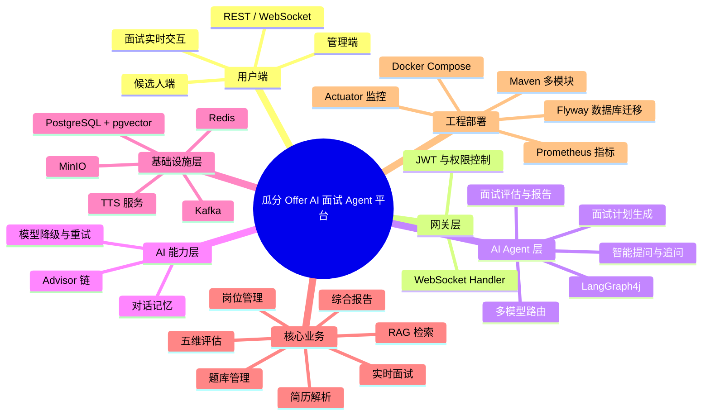
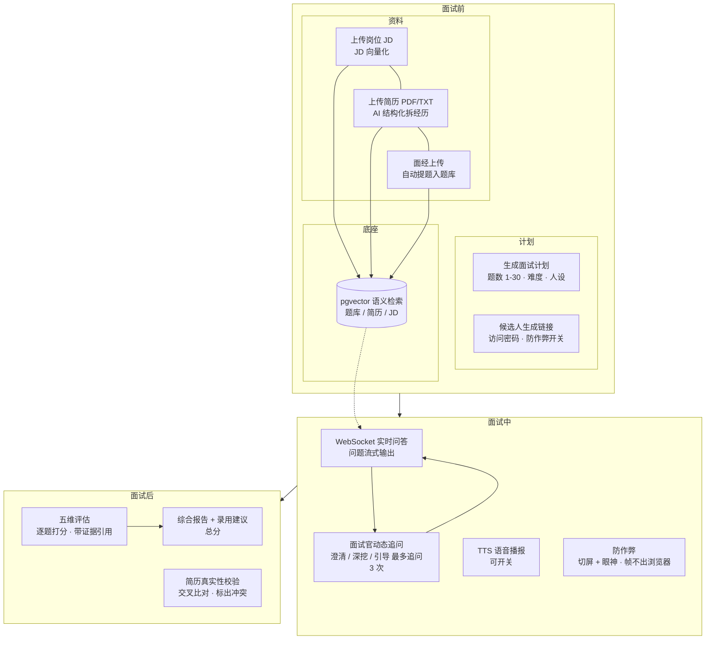
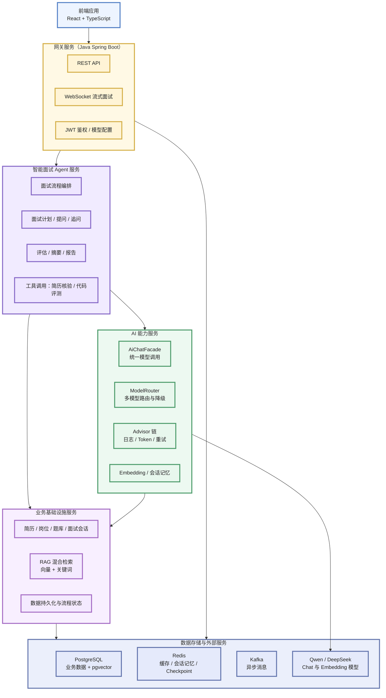
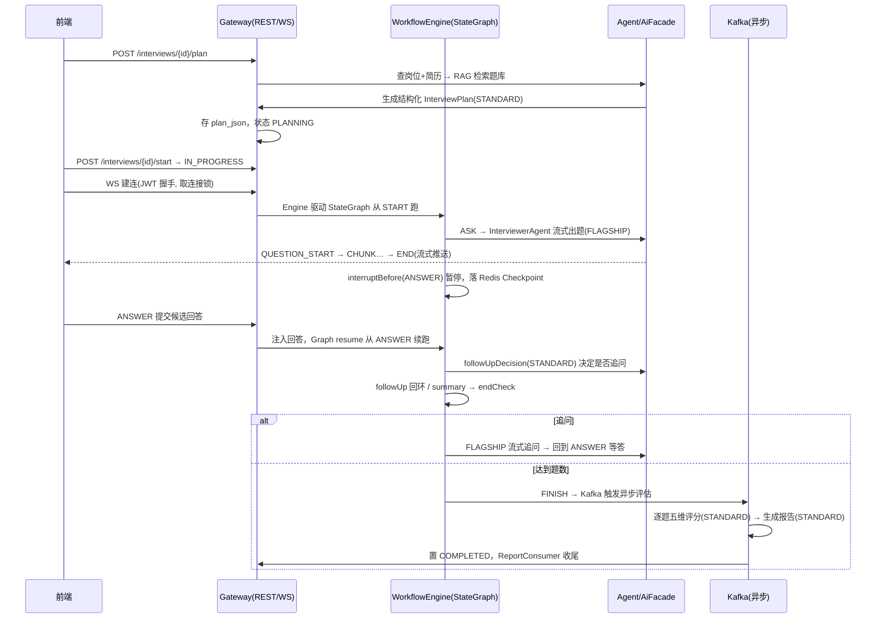

# 第1期 · 瓜分 Offer 是什么 

## 一、瓜分 Offer 是什么

### 1. 一句话定位

**瓜分 Offer 是一个基于 Spring Boot 3.5 + Spring AI 1.1 + LangGraph4j 的 AI 智能面试 Agent 平台**——它可以模拟一位资深面试官，把读简历 → 出题 → 追问 → 打分 → 出报告这一整套面试动作，从人肉流程变成了一条可配置、可回放、可度量的自动化流水线。

瓜分offer不只是一个题库 + 聊天框的堆砌，而是一套完整的产品：面试前有 `岗位 / 简历 / 题库 / 计划`，面试中有 `WebSocket 实时问答 / 动态追问 / TTS 语音 / 防作弊`，面试后有 `五维评估 / 综合报告 / 简历真实性校验`。你看到的每一个环节，背后都是一个 Agent 或一套异步链路在干活。

### 2. 瓜分offer的使用流程

**面试前**

瓜瓜要面一个后端岗，他先在后台上传了岗位 JD，又上传了几份候选人的简历（PDF/TXT）。系统自动开始处理：

- 简历被 AI 结构化解析，自动拆出**工作经历、项目经历、项目亮点、竞赛证书**，还能人工修正后自动重向量化；
- 瓜瓜把网上找到的面经传上去，系统自动提取出规范化的题目进入题库；
- 题库、岗位 JD、简历通通变成 **2048 维向量**，随时能被语义检索命中。

瓜瓜在`创建面试`里选好岗位 + 简历，一键**生成面试计划**——题数（1-30）、难度、面试官人设（温和 / 压力面 / 深度技术型）都可以配。计划不是简单的题目列表，而是按`自我介绍 / 技术考察 / 项目深挖 / 行为面试 / 反问 `切分的结构化方案。

**面试中**

系统生成一条**候选人专属链接**，候选人无需登录，输个访问密码就能进面试间。链接上还挂着两个防作弊开关：切屏检测 + 眼神检测。

面试在这里真正展示Agent成色：

- 前端建立 WebSocket 长连接，面试官的问题**逐字流式**吐出，实时渲染；
- 瓜瓜的每个回答都会被审一遍：**答得空泛就深挖（DEEPEN）、提到技术没展开就追问原理、答偏了就拉回正轨（REDIRECT）、和简历对不上就要求澄清（CLARIFY）**——每个主问题最多追问 3 次；
- 可选开启 **TTS 语音播报**，问题用温柔或犀利的音色念出来；
- 整场面试瓜瓜在一个浏览器里完成，**切屏、眼神偏离的每一帧数据都只在本地 WASM 跑，不出浏览器**，异常事件才批量上报给**管理端面板**。

**面试后**

瓜瓜点**结束面试**，系统进入异步收尾：

- 按**五维**（专业能力 40% / 逻辑思维 20% / 沟通表达 15% / 岗位匹配 15% / 学习与潜力 10%）逐题打分，每分都附**证据引用**（原话片段），不凭空给分；
- 汇总成**综合报告 + 录用建议 + 总分**；
- 还有一手暗棋——**简历真实性校验**：系统把瓜瓜的回答里提到的公司和经历，与简历里的工作经历做交叉比对，标出**疑似未提及 / 存在冲突的地方**，甄别简历注水。

面试结束后不用守着屏幕，报告生成走 Kafka 异步，系统会调研LLM把报告生成出来。

### 3. 功能流程图

按面试生命周期 × 功能模块来读，比背清单直观得多：

### 4. 为什么要做这个项目

两个理由。

**场景真实**：招聘是刚需，AI 面试已被商业产品验证过付费价值，做出来不会为了用技术而用技术。

**技术全面**：一条面试业务线，从上到下串起了 **Agent 编排、RAG 语义检索、WebSocket 流式通信、Kafka 异步削峰、Redis 有状态恢复、多模型路由降级、并发与幂等防御**

---

## 二、技术栈

### 1. 语言与框架

- **Java 21 虚拟线程**：面试是典型的 IO 密集场景——一场面试同时挂着 WebSocket 长连接、调 LLM、等 Kafka、写 Redis。虚拟线程让**一个请求一条物理线程**的旧观念过时，IO 等待不再空耗线程，天然适配这类长连接 + 高并发的会话。
- **Spring Boot 3.5 + Spring AI 1.1**：Spring AI 用 **OpenAI 兼容协议**对接LLM，`base-url + api-key` 改个配置就能换模型。模型是可替换的，业务代码不用动。

### 2. AI 与编排

- **LangGraph4j**：这是最核心的选型。面试流程**不是一段线性脚本**（不是 `for question in questions: ask`），而是一张**状态图**——有**问完该不该追问？追问回答完回到哪？题数够没够要不要结束？**这类会**回头、会中断、会分支**的有状态逻辑。LangGraph4j 用 `StateGraph` 把 `plan → ask → answer → followUpDecision → (followUp|summary) → endCheck → (ask|END)` 画成图，配合 Redis Checkpointer 做**图级中断与断点恢复**。

### 3. 数据与中间件

- **PostgreSQL + pgvector**：`halfvec` 2048 维向量 + **HNSW 索引** + **pg_trgm 关键词模糊匹配**，做**向量 + 关键词 混合检索**——向量管语义相近，关键词管精确术语命中（比如框架名、技术栈）。
- **Redis**：承担四个角色——**会话记忆**（对话上下文）、**checkpoint**（图断点）、**会话锁**（同一会话只允许一个连接）、**缓存**（RAG 结果、RefreshToken、滚动摘要）。
- **Kafka （KRaft 单节点）**：评估、报告这类**耗时写操作**不进实时对话链路，投递到 `interview.evaluation.requested` / `interview.report.requested` 两个 topic 异步消化，削峰解耦。
- **MinIO**：存**简历原件、TTS 音频、报告**，前端不能直连对象存储，由后端 `/audio` 代理流出。

### 4. 前端与工程化

- **React 19 + TypeScript + Vite 6 + Tailwind CSS**，状态用 **Zustand**（面试间实时状态）、服务端数据用 **TanStack Query**（带轮询）。
- **可观测性**：Actuator + Micrometer，把**节点耗时、模型延迟、Token 成本**全部量化为指标。
- **纪律性工具**：**Flyway** 给 DDL 做版本化管理，**Spotless + Google Java Format** 强制统一代码格式。

---

## 三、架构

### 1. 总览图

后端按 Maven 多模块分层。**自上而下，就是一次请求从上到下的完整旅程。**

### 2. 六模块职责

| 模块 | 职责 | 关键词 |
| --- | --- | --- |
| `interview-core` | 领域模型、错误码、统一响应 | **零框架依赖** |
| `interview-ai` | 模型路由 / Advisor / 会话记忆 / Facade | **LLM 调用的统一出口**，ModelRouter 四档位守门，Advisor 链每次调用前置 |
| `interview-agent` | LangGraph4j 状态图 + 5 个 业务Agent + 一个总指挥 Agent | **面试流程的大脑** |
| `interview-infra` | pgvector RAG / 持久层 / Kafka / MinIO / TTS | **落地能力** |
| `interview-gateway` | REST / WS / JWT / Engine 驱动 | **唯一入口** |

### 3. 架构设计决策

**为什么 core 零依赖？**
因为**领域模型最稳定，框架会换、领域不会**。`SessionStatus` 状态机、`InterviewPlan`、五维评估模型这些是在描述业务本质，它们不该认识 Spring、MyBatis、Redis 任何一家。把它们关在框架之外，是给整个系统上了一份业务不会因为技术换代而推翻的保险。

**为什么单向依赖？**
`gateway → agent → ai → core` 一路向下，**编译期**就强制隔离了方向。好处是：**AI 层可以整体替换而不动业务编排**——今天用 Spring AI，明天想换 LangChain4j，只需要在 `interview-ai` 内部换实现，`interview-agent` 的流程图、`interview-gateway` 的 Handler 一行都不用改。依赖向下的每一层，都给了上层替换的底气。

### 4. 一次面试请求的完整旅程

把上面的模块图串成一条时间线，你会看到数据如何在六层之间流动：

**一次请求的完整旅程**：REST 生成计划 → WebSocket 建连（JWT / GuestToken 握手）→ Engine 驱动 StateGraph → 问题流式推送 → 候选人答题 → 图 resume → 追问 / 下一题 → 结束 → Kafka 异步评估 / 报告。**实时性交给 WebSocket 和流式输出，耗时计算甩给 Kafka 异步**，分工明确。

