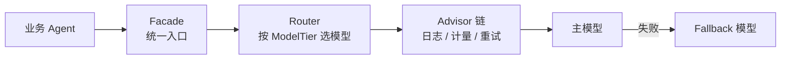
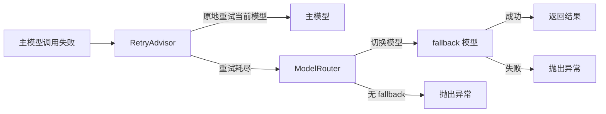
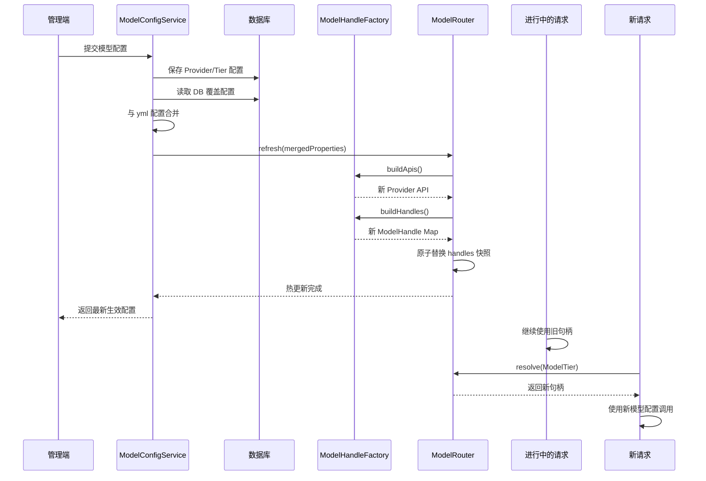
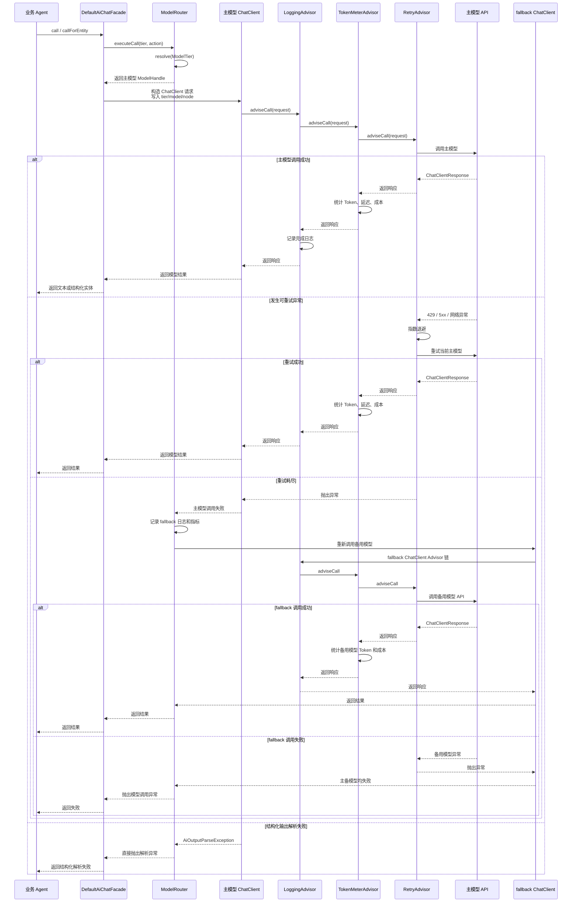
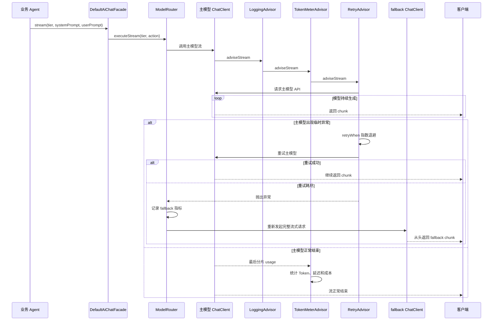
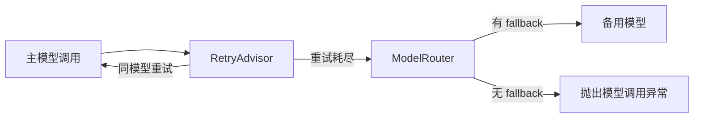

# 第2期：多模型路由与 Advisor 链设计方案

## 一、多模型路由

### 什么是多模型路由：
多模型路由是根据任务类型选择不同模型档位，而不是所有任务都使用同一个模型。

在本项目中，定义了四个档位：
|档位|典型用途|
|--|--|
|FLAGSHIP|面试主对话、复杂问题生成|
|STANDARD|追问决策、答案评估|
|ECONOMY|摘要、报告初稿|
|EMBEDDING|简历、题库、JD 向量化|

Agent在调用模型时，指定模型档位，如：
```java
aiChatFacade.call(
    ModelTier.STANDARD, // 选择标准档位
    systemPrompt,
    userPrompt
);
```

### 为什么需要多模型路由：
原因有下面几个：
1. **不同任务对模型性能要求不同**：
    - 如生成面试问题会调用 FLAGSHIP 模型，因为面试对话最直接影响用户体验，需要较好的理解能力、表达能力和上下文连贯性；
    - 如生成面试计划、判断是否追问等任务会调用 STANDARD 模型，因为这些任务需要一定推理能力，但不一定需要最高质量自然对话；
    - 如生成面试过程中的摘要、将原始简历解析成结构化简历对象会调用 ECONOMY 模型，因为这些任务通常是批处理、摘要或格式化解析，对实时交互体验要求相对低，因此使用成本更低、速度更快的模型。
    - 如简历向量化、岗位向量化等会调用 EMBEDDING 模型，因为这些任务是将文本内容转换为向量表示，用于后续的相似度计算、分类等任务。
2. **不同模型的成本不同**：如果都用同一个模型，会出现为了好的效果，成本过高或者为了节省成本，模型性能过低的情况。
3. **提高可用性**：每个档位可以配置主模型和备用模型，当主模型不可用时，会自动切换到备用模型，确保服务的高可用性。
    ```java
    FLAGSHIP:
        provider: deepseek
        model: deepseek-v4-pro
        fallback: deepseek:deepseek-v4-flash
    ```
4. **支持模型供应商替换**:项目通过 OpenAI 兼容协议接入不同供应商的模型，用户可以根据需要选择不同的供应商。

### 多模型路由是怎么实现的:
1. **配置层：yml + DB 双层合并**
    - application.yml 定义 aims.ai：providers（提供商接入信息）、tiers（档位→模型映射）、pricing（价目表）、retry（重试策略），全部支持 `AIMS_*` 环境变量覆盖。
    - AiModelProperties.java 通过 @ConfigurationProperties(prefix = "aims.ai") 绑定配置。
    - DB 增量覆盖层（ai_provider_config / ai_tier_config 表）：由 ModelConfigService 启动时合并出生效配置AiModelProperties，NULL 字段沿用 yml。
2. **装配层：启动时预构建句柄**
    ChatClientConfig.java 装配 ModelRouter Bean，核心工作在 ModelHandleFactory.java：
     1. buildApis() — 每个 provider 建一个 **OpenAiApi**（base-url + api-key，OpenAI 兼容协议，Qwen/DeepSeek 都能接）。
     2. buildHandles() — 每个档位建一个 **ModelHandle**：
        - 对话档位：ChatClient（内嵌 Advisor 链：Logging→TokenMeter→Retry）+ 可选 fallback ChatClient（解析 fallback: "provider:model"）；
        - EMBEDDING 档位：OpenAiEmbeddingModel。
        - 每个 provider 一个 **Semaphore** 并发闸口。
     3. 句柄存入不可变 Map<ModelTier, ModelHandle>，用以 O(1) 内存查找。


3. **运行时调用链**


4. **降级策略**

以`FLAGSHIP`档位为例：
   - 调用主模型ds4pro失败，RetryAdvisor 会进行重试，最多两次重试
     - 如果重试成功则返回结果
     - 如果两次重试都失败，则ModelRouter记录fallback指标，并切换到fallback模型，如果fallback模型成功，则返回结果，否则抛出模型调用失败异常

5. **模型配置热更新**



## 二、Advisor 链 
### Advisor 是什么
Advisor 是 Spring AI 的请求拦截器机制（类似 Servlet 的 Filter、Spring MVC 的 Interceptor）：在 ChatClient 真正调用模型之前/之后插入横切逻辑。项目里用它做日志、计量、重试，而业务代码完全无感。
==Advisor将业务逻辑和模型调用解耦，使业务代码更简洁、更易维护。==

### 项目里有哪些 Advisor
1. **LoggingAdvisor**：记录调用日志和耗时：
    负责记录：
    - 模型档位
    - 实际使用模型
    - Prompt摘要
    - 调用耗时（毫秒）
    - 调用成功/失败
2. **TokenMeterAdvisor**：Token、延迟和成本统计：
    负责读取模型返回的usage，并记录：
    - Prompt Token
    - Completion Token
    - 模型响应延迟
    - 根据模型价目表估算的成本
    - 当前Agent图节点消耗的Token

这些指标可以用来分析：

    哪个模型消耗 Token 最多
    哪个流程节点成本最高
    哪个模型响应最慢
3. **RetryAdvisor**：当前模型的原地重试：
    负责处理临时性模型调用失败，例如：
    - 网络异常
    - IO异常
    - HTTP 429限流
    - HTTP 5xx服务端错误
    - Spring AI 标记的瞬时异常
项目里的配置是：
```yaml
retry:
  max-attempts: 2 // 最大重试次数
  initial-backoff: 500ms // 初始重试间隔
```

### 为什么要用 Advisor 链
最重要的原因就是：
**如果没有 Advisor，每个 Agent 都要自己编写类似逻辑：**
```java
try {
    记录开始时间();
    调用模型();
    读取 Token();
    计算成本();
} catch (Exception e) {
    判断是否重试();
    执行重试();
}
```
这样就会导致几个问题：
- **重复代码严重**：Interviewer、Evaluator、Summary、Report 等 Agent 都需要写一套日志、重试和统计代码。
- **行为不一致**：不同Agent可能使用不同的重试次数、异常判断、日志格式、Token统计方式等。
- **难以统一治理**：如果需要增加新的横切逻辑，需要在每个 Agent 都修改代码，这会导致代码维护成本增加。
- **业务代码和基础设施代码耦合**：Agent 本来只应该关心 Prompt、模型结果和业务流程，不应该关心 HTTP 429、Micrometer 或退避算法。

### Advisor 链的调用链路
**阻塞调用链路**：

**流式调用链路**：


### Advisor和ModelRouter的关系
RetryAdvisor：原地重试同一个模型
ModelRouter：重试耗尽后切换备用模型

完整的降级链路：


## 数据库表设计
1. **模型服务商配置表`ai_provider_config`**

| 字段名 | 数据类型 | 是否主键 | 描述 |
|---|---|---|---|
| name | VARCHAR(64) | 是 | Provider 名称，如 `dashscope`、`deepseek` |
| base_url | VARCHAR(512) | 否 | OpenAI 兼容接口地址 |
| api_key_enc | VARCHAR(512) | 否 | AES-GCM 加密后的 API Key |
| max_concurrency | INT | 否 | Provider 最大并发数 |
| updated_by | VARCHAR(64) | 否 | 最后修改人 |
| updated_at | TIMESTAMPTZ | 否 | 最后更新时间 |

2. **模型档位配置表`ai_tier_config`**

| 字段名 | 数据类型 | 是否主键 | 描述 |
|---|---|---|---|
| tier | VARCHAR(32) | 是 | 模型档位，如 `FLAGSHIP`、`STANDARD` |
| provider | VARCHAR(64) | 否 | 当前档位使用的 Provider |
| model | VARCHAR(128) | 否 | 主模型名称 |
| temperature | NUMERIC(3,2) | 否 | 模型采样温度 |
| max_tokens | INT | 否 | 最大输出 Token 数 |
| dimensions | INT | 否 | Embedding 向量维度 |
| fallback | VARCHAR(64) | 否 | 备用模型，格式为 `provider:model` |
| thinking | BOOLEAN | 否 | 是否开启思考模式 |
| reasoning_effort | VARCHAR(16) | 否 | 推理强度，如 `low`、`high` |
| override_base_url | VARCHAR(512) | 否 | 当前档位独立的接口地址 |
| override_api_key_enc | VARCHAR(512) | 否 | 当前档位独立的加密 API Key |
| updated_by | VARCHAR(64) | 否 | 最后修改人 |
| updated_at | TIMESTAMPTZ | 否 | 最后更新时间 |

