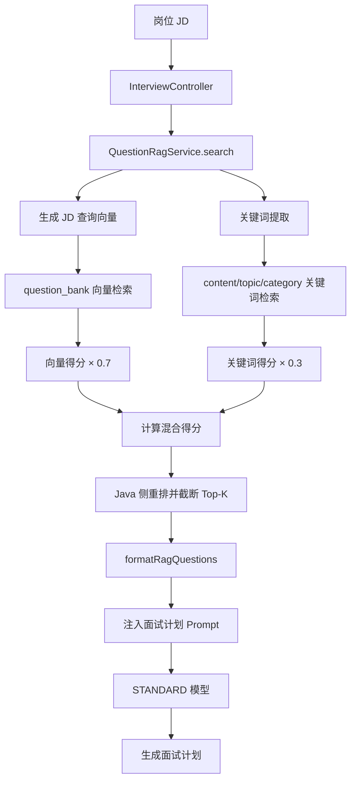
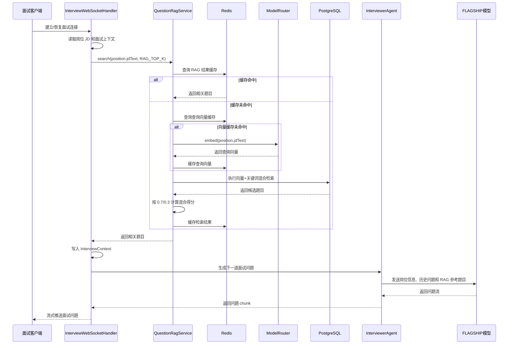
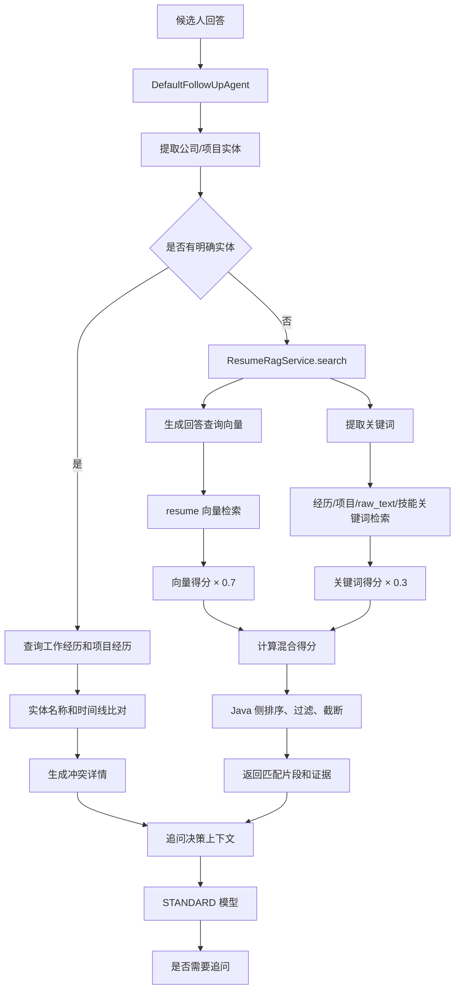
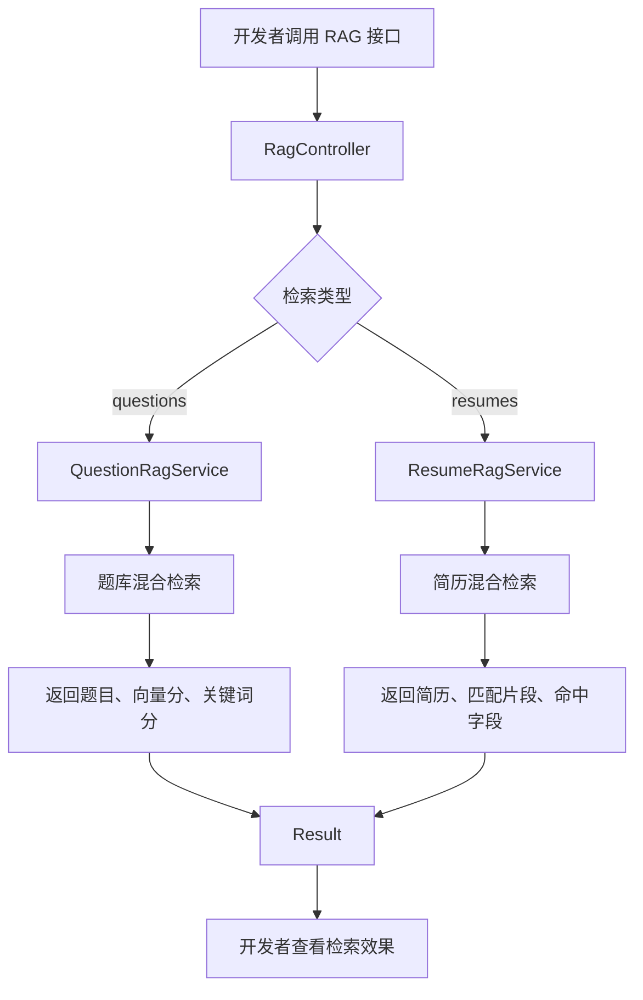
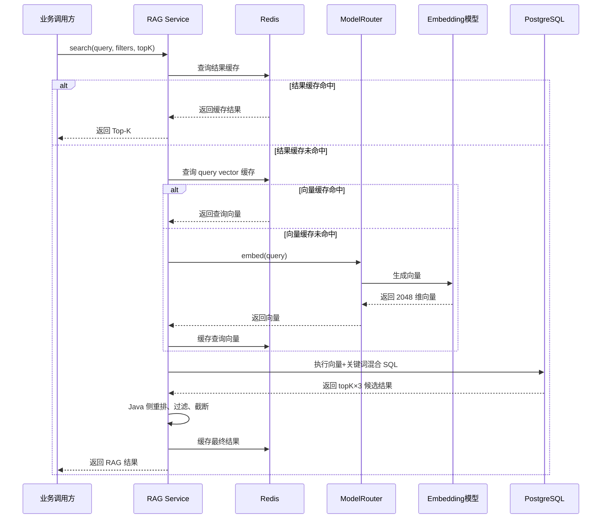
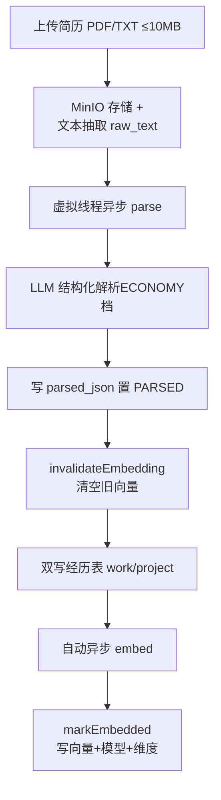
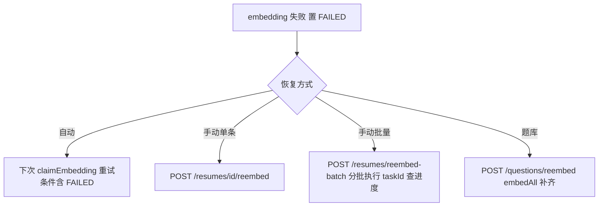

# 第3期：RAG 混合检索设计方案

## RAG是什么
RAG 全称是 Retrieval-Augmented Generation，即“检索增强生成”。

传统大模型只依赖自身训练知识：

    用户问题 → 大模型 → 回答
而RAG则会先从项目自己的数据库中检索相关资料，再把检索结果交给大模型：

    用户问题
        ↓
    检索项目知识库
        ↓
    得到相关内容
        ↓
    拼接到 Prompt
        ↓
    大模型生成回答

**RAG 通常包含三个阶段：**
1. 文档向量化并保存；
2. 根据查询召回相关内容；
3. 将召回结果注入 Prompt，增强大模型生成。

## 项目为什么需要 RAG
瓜分Offer是一个Agent面试平台，很多信息都来自用户自己的业务数据：
- 岗位JD
- 题库（无的话LLM生成）
- 用户简历

这些内容不是大模型的训练知识，而是用户自己的业务数据，不能只依赖模型记忆。

### 项目里用到的 RAG 混合检索的地方
#### 1. **生成面试计划：岗位 JD 检索题库**
生成面试计划时，如果完全依赖大模型自由生成，可能会出现：
- 生成的问题和岗位要求不匹配；
- 忽略岗位 JD 中的关键技术栈；
- 问题难度不符合要求；
- 题目重复或缺少题库中的经典问题。
因此系统先用岗位 JD 检索题库中的相关题目，再将这些题目作为参考资料交给大模型生成面试计划。
```java
List<QuestionSearchResult> ragResults =
        questionRagService.search(
                position.getJdText(),//获取岗位JD文本
                RAG_TOP_K//返回TopK个相关题目
        ).results();

String ragQuestions = formatRagQuestions(ragResults); //规范格式化题目文本

InterviewPlan plan =
        planGenerator.generate(
                resume.getCandidateName(),
                position.getTitle(),
                position.getJdText(),
                resumeSummaryBuilder.build(resume),
                ragQuestions, //传入检索到的题目
                questionCount,
                difficulty,
                estimatedMinutes    
        );
```
**题库混合检索得分：**
最终得分 = 向量得分 × 0.7 + 关键词得分 × 0.3
关键词检索字段包括：
- content：题目内容；
- topic：题目主题；
- category：题目分类。
检索结果会被格式化为 ragQuestions，再注入面试计划 Prompt。
**链路：**

#### 2. **WebSocket 面试过程中：检索参考题目**
面试开始后，面试官 Agent 需要根据：
- 当前岗位；
- 岗位 JD；
- 候选人简历；
- 已经问过的问题；
- 题库中的相关问题；
动态生成下一道面试题。
如果每轮都完全依赖大模型自由发挥，问题可能逐渐偏离岗位要求。因此 WebSocket 面试流程会再次根据岗位 JD 检索题库，将相关题目作为面试上下文的一部分。

先根据岗位 JD 检索题库中的相关题目
```java
List<QuestionSearchResult> ragResults =
        questionRagService.search(
                position.getJdText(),
                RAG_TOP_K
        ).results();

String ragQuestions = formatRagQuestions(ragResults);
```
然后将结果放入：

    InterviewContext
后续`InterviewerAgent`会使用这个上下文生成问题。
**链路**

#### 3. **追问决策：回答与简历交叉验证**
候选人在面试中可能会提到：
- 某家公司；
- 某个项目；
- 某项技术；
- 某段工作经历；
- 某个时间范围。
系统需要判断这些内容是否和候选人简历一致，从而发现：
- 简历中没有提到的经历；
- 公司或项目名称不一致；
- 工作时间线冲突；
- 回答可能存在夸大或虚构。
这些信息会影响追问 Agent 是否继续追问。

追问决策前，`DefaultFollowUpAgent`会执行矛盾探测：
```java
ResumeCrossCheckResult r =
        resumeCrossCheckTool.crossCheck(
                context.resumeId(),
                context.answer(),
                mention.resolvedName()
        );
```
`ResumeRagCrossCheckExecutor`采用两级策略
- **第一级：实体级比对**
  先查询简历里的工作经历和项目经历，然后去比对公司名称、项目名称、回答中的年份、简历中的起止时间是否一致。如果能识别出明确的公司或项目，就优先使用实体级精确判断。
- **第二级：RAG混合检索回退**
    如果没有明确的实体，则调用：
    ```java
    resumeRagService.search(
            answerText,//回答文本
            candidateResumeId,//候选人简历ID
            1,//Top-K
            null //最低得分阈值（过滤低分结果）
    );
    ```
**链路**


#### 4. **RAG 调试和验证接口**
该部分主要用于开发环境调试和验证，不是核心业务流程。

这个地方的功能是用来验证：
- 向量检索结果是否合理；
- 关键词检索是否命中；
- 混合得分是否符合预期；
- 命中了哪些字段；
- 返回的高亮片段是什么；
- 题库或简历的 RAG 数据是否完整。
**链路**


## 项目里怎么实现 RAG 混合检索
在我们的项目里，RAG 混合检索的实现是在 `QuestionRagServiceImpl` 和 `ResumeRagServiceImpl` 中的。
核心逻辑是：

    向量语义检索 + ILIKE 关键词检索
    最终得分 = 向量得分 × 0.7 + 关键词得分 × 0.3
**具体如下：**
1. **文档向量化**
    题目、简历、岗位描述等文档通过：
    ```java
    modelRouter.embed(text)
    modelRouter.embedBatch(texts)
    ```
    调研`Embedding`档位的模型生成2048维向量。
    项目里默认使用的是阿里的text-embedding-v4模型。
    向量保存到 PostgreSQL 的 halfvec(2048) 字段,并使用 pgvector 的 HNSW 索引加速检索。
2. **查询时生成查询向量**

首先检查 Redis 查询向量缓存：

    rag:embed:{md5(query)}

缓存命中时直接使用缓存向量；未命中时调用：

    modelRouter.embed(query)
生成向量后写入 Redis，TTL 为 30 分钟。
3. **向量检索**
项目中使用PostgreSQL的pgvector的余弦相似度检索：
```sql
1 - (embedding <=> ?::halfvec) //1- 向量的余弦相似度距离，分数越接近1，相似度越高。
```

4. **关键词检索**
项目没有使用传统倒排索引，而是使用 PostgreSQL 的：
```sql
ILIKE '%keyword%'
```
并通过`pg_trgm`索引优化模糊匹配。
SQL 里把整个 query 当成一个关键词做 ILIKE '%整句%',然后 CASE WHEN 按 content→topic→category 顺序取第一个命中的档位分
项目里的的字段和打分如下：
- 题库关键词字段：
    - content -> 1.0
    - topic -> 0.9
    - category -> 0.8
- 简历关键词字段：
    - 工作经历 -> 1.0
    - 项目经历 -> 0.95
    - raw_text -> 0.9    
    - skills -> 0.85
    - 候选人姓名 -> 0.8

5. **SQL 中直接计算混合分数**
SQL会同时计算向量得分和关键词得分，最后在排序时根据权重计算混合得分。
例如题库检索：
```sql
ORDER BY
    (1 - (embedding <=> ?::halfvec)) * 0.7
    +
    CASE
        WHEN content ILIKE '%' || ? || '%' THEN 1.0
        WHEN topic ILIKE '%' || ? || '%' THEN 0.9
        WHEN category ILIKE '%' || ? || '%' THEN 0.8
        ELSE 0.0
    END * 0.3
DESC
```
项目不是先查一批向量结果、再查一批关键词结果后在 Java 中合并，而是在一条 SQL 中同时计算两种分数。

6. **Java 侧重排和截断**
数据库会先返回：tokK x 3
例如请求 `topK = 5` ，数据库会返回 15 条结果。
然后java侧再次按照：
```java
Comparator.comparingDouble(Result::score).reversed()
```
排序，最后截取真正的 Top-K。
这样做可以给 Java 侧留出更多候选，避免数据库预截断导致相关结果被遗漏。

7. **故障降级**

项目里的混合检索的降级策略是：

    混合检索失败
        ↓
    退化为纯向量检索
        ↓
    纯向量检索也失败
        ↓
    抛出 RAG_SEARCH_FAILED

**链路**


## RAG 数据是怎么入库的（向量化写入管道）
前面讲的都是查询时发生的事情，但 RAG 的第一阶段——“文档向量化并保存”——发生在数据写入时。这部分链路在简历侧和题库侧是两套不同的设计。
### **1. 简历侧：上传 -> 解析 -> 双写经历表 -> 向量化**

1. **两套独立状态机**
简历表上有两个状态列，各自独立流转：
```text
parse_status:PENDING -> PROCESSING -> PARSED | FAILED //解析状态机
embedding_status:PENDING -> PROCESSING -> COMPLETED | FAILED //向量化状态机
```
==FAILED不是死状态，都可以重新抢占重试==

2. **原子抢占防止重复处理**
因为parse和embed都是异步自动触发的，可能重复触发。项目没有加锁，而是用条件UPDATE原子抢占：
```sql
UPDATE resume SET parse_status = 'PROCESSING',parse_attempts = parse_attempts + 1
WHERE id=#{id}
    AND parse_status IN ('PENDING','FAILED')
```
并发下的话就只有一个线程的UPDATE影响行数为1，其余线程返回0直接跳过。`claimEmbedding` 更严格，要求 `parse_status='PARSED' AND embedding_status IN ('PENDING','FAILED')`——即只有解析成功的简历才会被向量化。

3. **LLM结构化解析代替 chunking**

parse 阶段调用 `AiChatFacade.callForEntity(ModelTier.ECONOMY, ...)` 将简历原文解析成 `ParsedResume` 结构（候选人信息、技能、工作经历、项目经历等），提示词约束：只输出JSON、字段不确定返回null、不得编造，保留原始技术名词。

这是本项目RAG设计的一个重要决策：不做传统的RAG的文档切片。因为embed的输入不是简历原文，而是`buildEmbeddingText`拼接的解析后的结构化文本：
```text
候选人：{name}
当前职位:{currentTitle}
工作年限：{N}年
技能：{skill1、skill2}
工作经历：
- {company} / {title} ({period}) : {description}
项目经历：
- {name} / {role} ({period}) : {description}
```
简历原件的噪音大（可能有自我评价之类的），LLM提炼后的信息密度高，一份简历一个向量就够了，天然避开了切片、重叠、父子块之类的传统RAG的复杂度。

4. **双写经历表**

解析成功后，同一份数据会写到两个地方：
- parsed_json 列： LLM解析结果的原文，给前端展示和人工编辑用；
- resume_work_experience / resume_project_experience 两张经历表：拆成结构化行，给检索和交叉验证用。

拆表的目的是为了追问场景的“实体级比对”，实体级比对时会查这两张表，按公司名、项目名、起止时间做精确判断；简历混合检索 SQL 里的 work_text / project_text 也是从这两张表里读取的。`syncFromParsed` 采用先删除后插入的全量重建保证幂等，不会出现新旧两版经历混存。

5. **向量失效与一致性**

`invalidateEmbedding` 会清空旧向量以及全部元数据（embedding、模型名、维度、时间），把状态重置为 PENDING ，使该记录重新变为“待向量化”状态，在三个地方会被调用：
- parse成功后；
- 人工修改 parsed_json 后；
- 手动 reembed 时。
也就是说，简历内容只要变化，JSON、经历表、向量三处都会同步刷新，避免了“改了简历但是检索到旧内容”

### **2. 题库侧：尽力嵌入 + 事后补齐**

题库侧没有状态机，策略比较简单：同步embed，失败不阻断业务：
```java
try{
    float[] vector = modelRouter.embed(entity.getContent());
    baseMapper.updateEmbedding(entity.getId(), PgVectorSupport.toVectorString(vector));
} catch (Exception e){
    log.warn("创建题目后向量化失败，id={}", entity.getId(), e);
}
```
- create: insert 后同步 embed，失败只打warn日志，不阻断创建；
- update: 仅当 content 变化时才同步 embed；
- batchImport： 批量落库后虚拟线程异步 `embedBatch`；
- embedAll： 循环查 `embedding IS NULL` 的记录批量补齐，这就是失败后的兜底。

题库的数据来源还有一个面经异步解析：用STANDARD档将面经文本解析成题目落库，再向量化。


### **3. 失败恢复**
写入侧是“尽力而为 + 事后补偿”，和读取侧的降级策略（混合检索失败 → 纯向量 → 抛错）呼应：

重新向量化的判据是 `embedding IS NULL AND parse_status='PARSED'`——失败时向量保持 NULL，所以这个查询天然能兜住所有漏网记录。

## **为什么用 halfvec 而不是 vector**
项目里的向量是用阿里的 text-embedding-v4 生成的，**2048 维**。最初建表时 embedding 列用的是 pgvector 默认的 vector(2048) 类型，后来在迁移脚本 `V2_0_5__add_hnsw_vector_indexes.sql` 里统一改成了 halfvec(2048)。原因是：

pgvector 的 HNSW 索引，对 vector 类型最多只支持 2000 维；对 halfvec 类型最多支持 4000 维。

也就是说，2048 维如果继续用 vector 类型，是建不了 HNSW 索引的——没有索引，embedding <=> ? 的余弦距离计算就只能对全表做顺序扫描。题库几百题可能感觉不到，但简历表会随用户增长，数据量一上来，每次面试生成都要全表扫向量，延迟直接不可接受。
==HNSW 是一种分层的近邻图索引：每个向量是一个节点，查询时从顶层入口贪心地跳向更近的邻居、逐层下沉，用“走一小部分节点”代替全表扫描，拿 95%+ 的召回率换毫秒级检索。选它而不是 IVFFlat,是因为 HNSW 召回更稳、不需要训练聚类中心、对增量写入更友好——题库和简历都是不断新增的业务数据。==

所以迁移脚本做了两件事：


```sql
-- 1) 列类型从 vector(2048) 改为 halfvec(2048)
ALTER TABLE resume ALTER COLUMN embedding
    TYPE halfvec(2048) USING embedding::halfvec(2048);
-- question_bank、position 两张表同样处理

-- 2) 用 halfvec 专属的操作符建 HNSW 索引
CREATE INDEX idx_resume_embedding_hnsw
    ON resume USING hnsw (embedding halfvec_cosine_ops);
```

**halfvec 是什么**
halfvec 就是半精度浮点(float16)向量：每个维度从 4 字节降到 2 字节，一条 2048 维向量从 8KB 减到 4KB,存储直接省一半，HNSW 索引本身也随之变小、加载更快。

代价是精度：float16 只有约 3 位有效十进制数字。但对 embedding 检索这个场景，这点损失可以忽略——我们关心的是向量之间的相对排序，而不是每个分量的精确值。余弦相似度对微小的数值扰动是稳定的，两段文本的语义相似度不会因为小数点后第 4 位的误差而改变排序。迁移脚本的注释也是这么写的：“halfvec 使用半精度浮点，存储减半，检索精度损失极小”。

**查询侧的配合**
因为列类型是 halfvec,SQL 里传入查询向量时要做显式转换，这就是检索 SQL 里 ?::halfvec 的由来：


```sql
1 - (embedding <=> ?::halfvec)  -- halfvec 的余弦距离操作符
```
Java 侧则由 `PgVectorSupport.toVectorString()` 把 float[] 拼成 pgvector 认识的字符串字面量。
