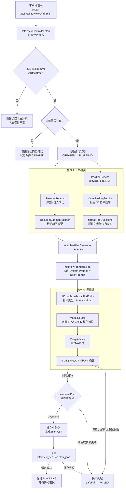
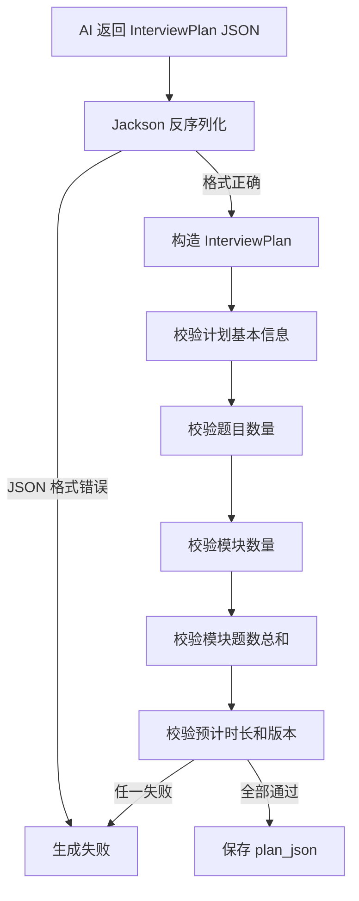
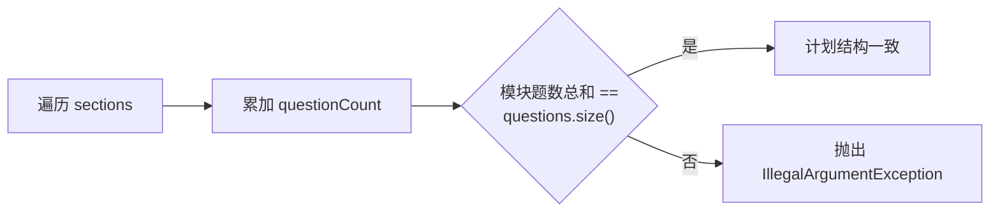
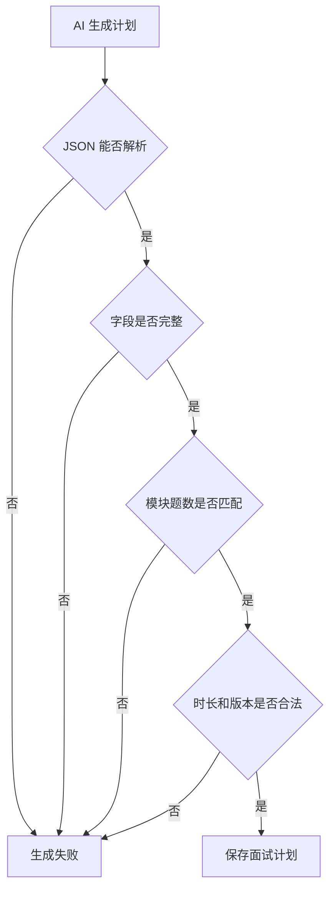
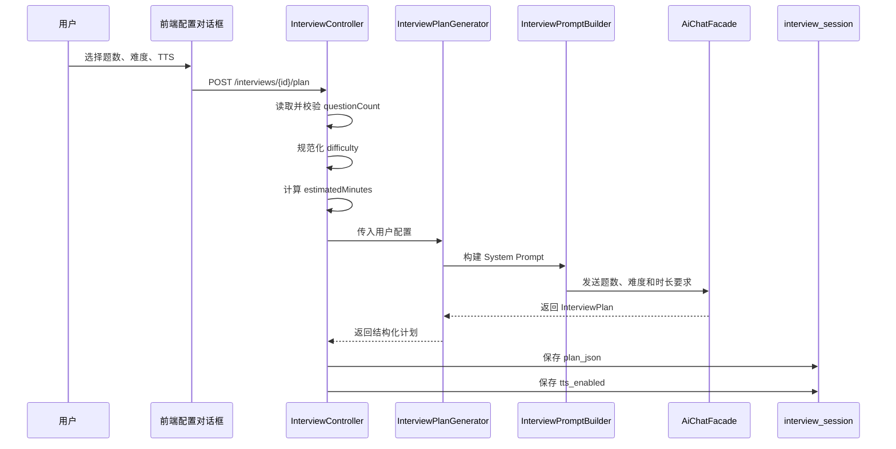
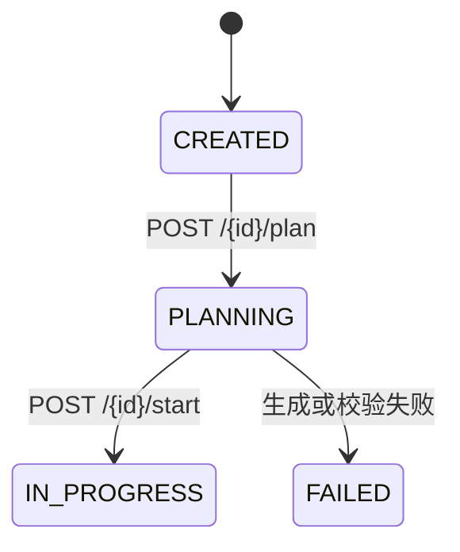
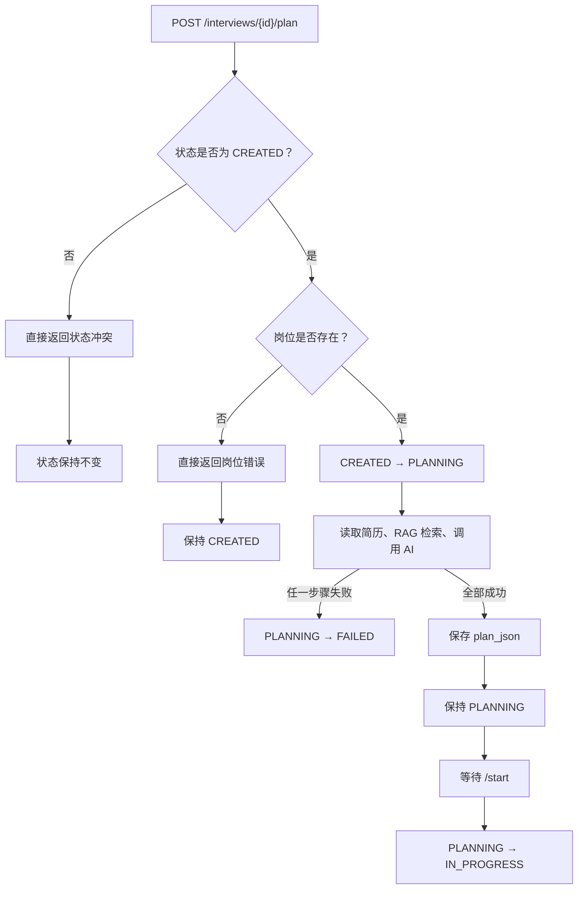

# 第4期 面试计划 设计方案

## 为什么需要面试计划
1. **从“随机出题”到“有目标的面试”**
- 固定面试目标、题目数量和时间
- 保证题目覆盖岗位 JD
- 根据候选人简历设计个性化问题
- 为后续追问、评价和报告提供结构化依据

2. **一个合格的面试计划是怎样的**
- 候选人和岗位信息
- 面试模块划分
- 每个模块的题目数量和考察目标
- 每道题的主题、难度、追问提示
- 评价重点和预计面试时长

## 面试计划生成的链路
### 1. **从接口进入生成流程**：
- 校验面试会话状态，是`CREATED`才允许生成计划
- 读取岗位、简历、用户配置（面试题数、难度、是否开启TTS）
- 进入`PLANNING`状态

### 2. **组装生成上下文**
- `PositionService` 获取岗位 JD：获取岗位名称和岗位JD原文
- `ResumeService` 获取候选人简历
- `ResumeSummaryBuilder` 构建简历摘要：传入简历，返回简历摘要
类似于：
```
姓名：瓜瓜
当前职位：Java开发
工作年限：3 年
技能：Java、Spring Boot、Redis

工作经历：
- 某科技公司 Java 工程师（2023-2026）

项目经历：
- 订单系统 后端负责人（2025-2026）
```
- `QuestionRagService` 检索岗位相关题目：用岗位JD原文作为查询文本，从题库检索最多10道相关的面试题目。
```java
public interface QuestionRagService {

    RagSearchResponse<QuestionSearchResult> search(
            String query,
            int topK);

    RagSearchResponse<QuestionSearchResult> search(
            String query,
            QuestionFilter filter,
            int topK);
}
```
- `formatRagQuestions` 转换为 Prompt 文本：将检索到的面试题目转换为符合要求的 Prompt 文本。
类似于：
```
- [Java/中等] HashMap 的底层实现原理是什么？
- [Redis/困难] Redis 缓存击穿有哪些解决方案？
- [系统设计/困难] 如何设计一个高并发订单系统？
```

### 3. **调用 Agent 生成计划**
- **InterviewPlanGenerator：负责协调“生成面试计划”这件事**
  - 接收岗位、简历、题库和用户配置
  - 选择使用的模型档位
  - 调用 Prompt 构建器
  - 调用AiChatFacade
  - 将模型结果转换为 **InterviewPlan**


- **InterviewPromptBuilder：把业务数据组装成模型能理解的 Prompt**
主要构建两部分：
  - planSystem()：系统 Prompt
```
你是面试计划设计专家。

要求：
1. 只能基于岗位、简历和题库事实生成计划
2. 题目数量必须为指定数量
3. 按指定难度偏好分配 EASY/MEDIUM/HARD
4. 每道题必须包含 topic、difficulty、evaluationFocus
5. 计划模块题目数之和必须等于总题数
6. 只输出符合 InterviewPlan schema 的 JSON
```
  - planUser()：用户 Prompt
```java
public static String planUser(
        String candidateName,
        String positionTitle,
        String jdText,
        String resumeSummary,
        String ragQuestions,
        int estimatedMinutes) {

    return """
            岗位名称：%s
            岗位 JD：%s
            候选人姓名：%s
            简历摘要：%s
            题库参考题目：
            %s
            预计面试时长：%d 分钟

            请生成面试计划 JSON。
            """
            .formatted(
                    positionTitle,
                    jdText,
                    candidateName,
                    resumeSummary,
                    ragQuestions,
                    estimatedMinutes);
}
```


- **AiChatFacade.callForEntity：统一调用 AI，并要求模型返回指定 Java 类型。**
业务代码不直接依赖具体的 ChatClient 或模型供应商，统一由 AI 门面处理：
  - 模型路由
  - Prompt 发送
  - JSON 结构化解析
  - Advisor 链
  - 重试
  - 降级
  - 统一异常


- **使用 ModelTier.STANDARD**：面试计划需要一定的推理和结构化能力，但不一定需要面试实时对话使用的最高档模型，因此项目将它放在 STANDARD 档位


- 通过统一 AI 门面接入模型路由、重试和降级得到**InterviewPlan**

### 4. **保存面试计划**
- 保存到 interview_session.plan_json
- 返回 PLANNING
- 管理端预览计划
- 开始面试后交给 PlanNode 和 InterviewerAgent 执行

**链路图**


## 面试计划的数据结构与校验
### 1. **数据结构**
- InterviewPlan：整场面试的总体计划
- PlanSection：面试模块，例如“Java 基础”“项目经验”“系统设计”
- PlannedQuestion：模块中的一道计划题
==PlannedQuestion 不是最终展示给候选人的完整问题，它更像是一个提问约束==
例如：
```
主题：Redis 缓存
难度：HARD
评价重点：是否能解释缓存击穿、雪崩和热点 Key 方案
追问提示：继续追问一致性和故障恢复
```
后续 InterviewerAgent 会根据这些信息生成具体问法。

### 2. **校验**
面试计划不是普通 DTO，而是一个带有业务规则的领域对象。
AI 返回的 JSON 即使语法正确，也可能存在以下问题：
- 候选人为空
- 岗位为空
- 题目数量为 0
- 模块数量为 0
- 模块题数之和与实际题目数不一致
- 预计时长小于等于 0
- 计划版本为空
所以，`InterviewPlan`、`PlanSection` 和 `PlannedQuestion` 都在构造时执行校验。

**1. InterviewPlan 校验**
InterviewPlan 是整个面试计划的根对象，负责校验计划级别的约束。
```java
public InterviewPlan {
    if (candidateName == null || candidateName.isBlank()) {
        throw new IllegalArgumentException("候选人名称不能为空");
    }

    if (position == null || position.isBlank()) {
        throw new IllegalArgumentException("岗位名称不能为空");
    }

    sections = sections == null 
            ? List.of()
            : List.copyOf(sections);

    questions = questions == null
            ? List.of()
            : List.copyOf(questions);
}
```
这里将 null 集合转换为空集合，并进行防御性复制,List.copyOf() 可以防止外部代码在对象创建后修改计划内部的列表。
**2. 题目数量校验**
一个有效的面试计划题目不能为空。
```java
if (questions.isEmpty()) {
    throw new IllegalArgumentException("面试计划题目不能为空");
}
```
**3. 模块数量校验**
一个计划至少需要包含一个面试模块,如果没有模块，后续执行器就无法知道每道题属于哪一类考察内容:
```java
if (sections.isEmpty()) {
    throw new IllegalArgumentException("面试计划至少需要一个模块");
}
```
**4. PlanSection 的字段校验**
PlanSection 是面试中的一个模块：
```java
public record PlanSection(
        String name, // 模块名称
        int questionCount, // 模块中题目数量
        String objective // 模块考察的目标
        ) {
}
```
构造时会执行以下校验：
```java
public PlanSection {
    if (name == null || name.isBlank()) {
        throw new IllegalArgumentException("计划模块名称不能为空");
    }

    if (questionCount <= 0) {
        throw new IllegalArgumentException("计划模块题目数必须大于 0");
    }

    if (objective == null || objective.isBlank()) {
        throw new IllegalArgumentException("计划模块目标不能为空");
    }
}
```
**5. 模块题数与总题数校验**
```java
int sectionQuestionCount =
        sections.stream()
                .mapToInt(PlanSection::questionCount)
                .sum();

if (sectionQuestionCount != questions.size()) {
    throw new IllegalArgumentException(
            "计划模块题目数之和必须等于计划题目数");
}
```
计划模块题目数之和必须等于计划题目数，计划才可以执行。
否则系统就无法判断：
- 哪个模块缺少题目
- 是否需要临时补题
- 应该执行模块的题目数量还是实际的题目数量

**6. PlannedQuestion 的字段校验**
PlannedQuestion 表示一道计划题：
```java
public record PlannedQuestion(
        String questionId,
        String topic,
        String difficulty,
        List<String> followUpHints,
        String evaluationFocus) {
}
```
在构造时会执行以下校验：
```java
public PlannedQuestion {
    if (questionId == null || questionId.isBlank()) {
        throw new IllegalArgumentException("计划题目 ID 不能为空");
    }

    if (topic == null || topic.isBlank()) {
        throw new IllegalArgumentException("计划题目主题不能为空");
    }

    if (difficulty == null || difficulty.isBlank()) {
        throw new IllegalArgumentException("计划题目难度不能为空");
    }

    if (evaluationFocus == null || evaluationFocus.isBlank()) {
        throw new IllegalArgumentException("计划题目评价重点不能为空");
    }

    followUpHints = followUpHints == null
            ? List.of()
            : List.copyOf(followUpHints);
}
```
**7. 预计时长和版本校验**
```java
if (estimatedMinutes <= 0) {
    throw new IllegalArgumentException(
            "预计面试时长必须大于 0 分钟");
}

if (version == null || version.isBlank()) {
    throw new IllegalArgumentException(
            "计划版本不能为空");
}
```
**为什么要在对象构造时校验？**
Prompt中虽然约束了模型：只输出符合 InterviewPlan schema 的 JSON
但Prompt不能完全保证模型一定返回合法的业务数据
因此，完整的链路是：


## 用户配置如何进入生成流程


## 接口层与状态机、失败路径
面试计划生成通过两个接口完成：
```
POST /api/v1/interviews/{id}/plan
    生成并保存面试计划

POST /api/v1/interviews/{id}/start
    使用已保存的计划开始面试
```
**面试计划生成的状态流转**

各状态的含义：
- CREATED：面试会话已创建，但还没有面试计划
- PLANNING：计划正在生成，或计划已经生成并等待开始
- IN_PROGRESS：面试已经正式开始
- FAILED：计划生成过程中发生异常
只有**CREATE**状态允许生成计划，因此可以避免同一个会话重复调用AI覆盖已有的plan_json

**/plan只生成计划**
状态校验通过后，系统将会话设置为 PLANNING：
然后依次完成：读取简历、构建简历摘要、RAG检索题库、调用AI生成面试计划、结构化校验、序列化并保存 plan_json
计划保存成功后，状态仍然是**PLANNING**
只有调用 /start，才会执行面试计划,将状态设置为**IN_PROGRESS**

**生成失败时的处理**
进入 PLANNING 后，如果生成流程发生异常，系统会调用 safeFail()：
```java
catch (Exception e) {
    log.error("生成面试计划失败 sessionId={}", id, e);
    safeFail(id);
    throw new BizException(
            ErrorCode.SESSION_PLAN_FAILED,
            e.getMessage());
}
```
safeFail()尝试把面试会话状态改为 FAILED,如果修改状态本身也失败，只记录日志，不再抛出新的异常
```java
private void safeFail(Long id) {
    try {
        sessionService.updateStatus(
                id,
                SessionStatus.FAILED);
    } catch (Exception ex) {
        log.warn(
                "将会话置为 FAILED 失败 sessionId={}",
                id,
                ex);
    }
}
```

失败状态流转为**FAILED**
可能导致失败的原因包括：
- 简历读取或摘要构建失败
- RAG 查询失败
- AI 调用失败
- AI 返回内容无法反序列化为 JSON
- InterviewPlan 领域校验失败
- plan_json 序列化失败
- 数据库保存 plan_json 失败
==其中，RAG 返回空结果不一定是异常。当前实现会将空结果转换为**无相关题库参考**，然后继续生成计划==

**前置条件错误不会进入 FAILED**
有些错误发生在正式生成流程之前，不属于“计划生成失败”
例如，当前状态不是 CREATED：
```java
if (current != SessionStatus.CREATED) {
    throw new BizException(
            ErrorCode.SESSION_STATUS_CONFLICT);
}
```
这种情况会直接拒绝请求，不会执行safeFail()
原因是：用户修正前置条件后，还可以重新发起计划生成。
**总体链路图**



## 数据库表设计
1. 岗位表（position）

| 字段名 | 数据类型 | 是否主键 | 描述 |
|---|---|---|---|
| `id` | `BIGSERIAL` | 是 | 岗位 ID |
| `title` | `VARCHAR(200)` | 否 | 岗位名称 |
| `department` | `VARCHAR(100)` | 否 | 所属部门 |
| `jd_text` | `TEXT` | 否 | 岗位 JD 原文 |
| `requirements_json` | `JSONB` | 否 | 结构化岗位要求 |
| `status` | `VARCHAR(20)` | 否 | 岗位状态，默认 `ACTIVE` |
| `embedding` | `VECTOR` | 否 | 岗位 JD 向量 |
| `created_at` | `TIMESTAMPTZ` | 否 | 创建时间 |
| `updated_at` | `TIMESTAMPTZ` | 否 | 更新时间 |

2. 简历表（resume）

| 字段名 | 数据类型 | 是否主键 | 描述 |
|---|---|---|---|
| `id` | `BIGSERIAL` | 是 | 简历 ID |
| `candidate_name` | `VARCHAR(100)` | 否 | 候选人姓名 |
| `phone` | `VARCHAR(20)` | 否 | 手机号 |
| `email` | `VARCHAR(100)` | 否 | 邮箱 |
| `raw_text` | `TEXT` | 否 | 简历原文 |
| `parsed_json` | `JSONB` | 否 | 简历解析后的结构化数据 |
| `file_url` | `VARCHAR(500)` | 否 | 简历文件地址 |
| `parse_status` | `VARCHAR(20)` | 否 | 简历解析状态 |
| `embedding` | `VECTOR` | 否 | 简历向量 |
| `created_at` | `TIMESTAMPTZ` | 否 | 创建时间 |
| `updated_at` | `TIMESTAMPTZ` | 否 | 更新时间 |

3. 题目表（question_bank）

| 字段名 | 数据类型 | 是否主键 | 描述 |
|---|---|---|---|
| `id` | `BIGSERIAL` | 是 | 题目 ID |
| `category` | `VARCHAR(50)` | 否 | 题目分类，如 Java、Redis |
| `topic` | `VARCHAR(100)` | 否 | 题目主题 |
| `difficulty` | `VARCHAR(10)` | 否 | 题目难度 |
| `content` | `TEXT` | 否 | 题目内容 |
| `standard_answer` | `TEXT` | 否 | 参考答案 |
| `tags` | `TEXT[]` | 否 | 题目标签 |
| `embedding` | `VECTOR` | 否 | 题目向量 |
| `created_at` | `TIMESTAMPTZ` | 否 | 创建时间 |
| `updated_at` | `TIMESTAMPTZ` | 否 | 更新时间 |

4. 面试会话表（interview_session）

| 字段名 | 数据类型 | 是否主键 | 描述 |
|---|---|---|---|
| `id` | `BIGSERIAL` | 是 | 面试会话 ID |
| `resume_id` | `BIGINT` | 否 | 关联简历 ID |
| `position_id` | `BIGINT` | 否 | 关联岗位 ID |
| `status` | `VARCHAR(20)` | 否 | 会话状态 |
| `plan_json` | `JSONB` | 否 | 结构化面试计划 |
| `tts_enabled` | `BOOLEAN` | 否 | 是否启用 TTS |
| `started_at` | `TIMESTAMPTZ` | 否 | 开始时间 |
| `ended_at` | `TIMESTAMPTZ` | 否 | 结束时间 |
| `total_score` | `NUMERIC(5,2)` | 否 | 总分 |
| `created_at` | `TIMESTAMPTZ` | 否 | 创建时间 |
| `updated_at` | `TIMESTAMPTZ` | 否 | 更新时间 |