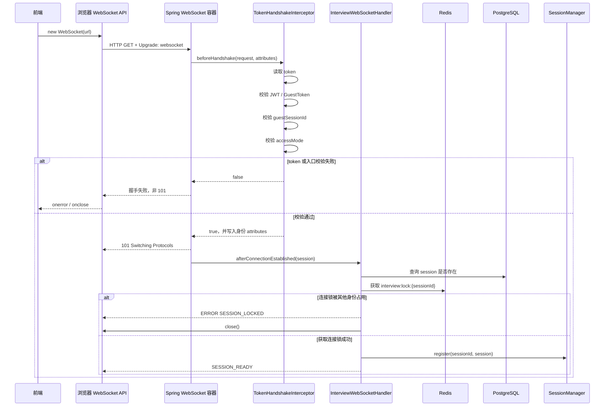
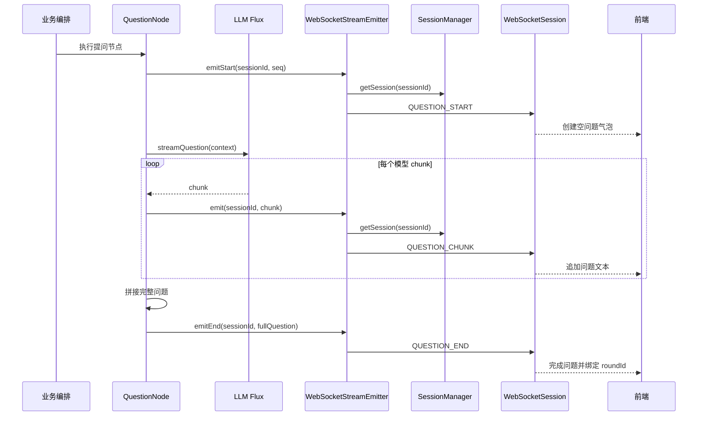
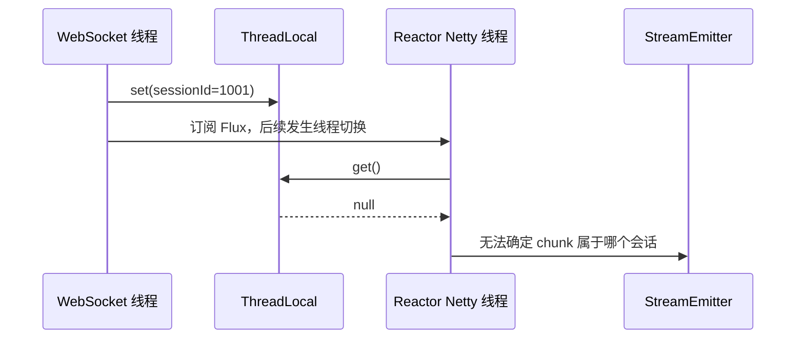
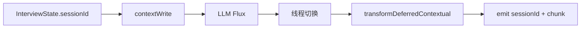
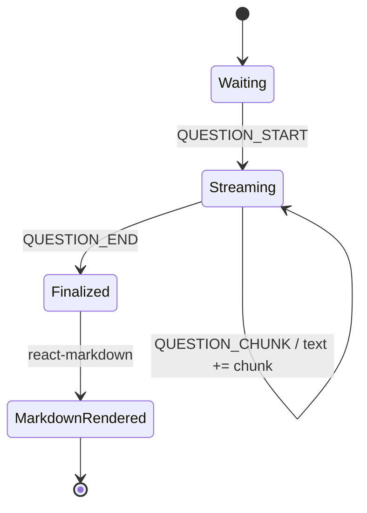
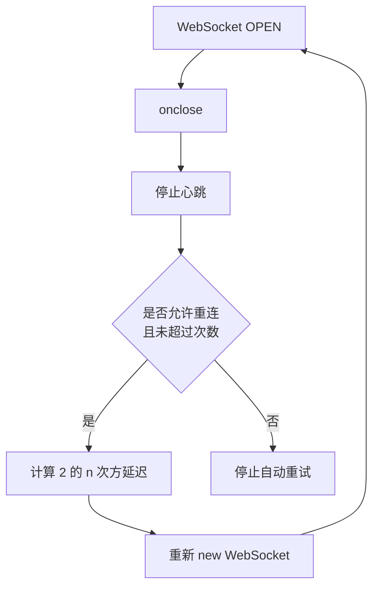
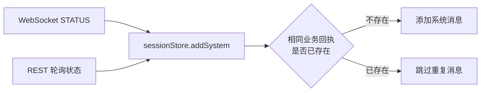

# 第5期 WebSocket 流式问答 设计方案

## WebSocket 是什么
WebSocket 是建立在 HTTP Upgrade 之上的长连接协议。握手成功后，浏览器和服务端可以在同一条连接上双向主动发送消息：
- 服务端主动推送AI问题的每个chunk
- 客户端随时提交回答、暂停、结束
- 服务端异步推送TTS音频、状态变化和错误信息

项目没有使用 STOMP，而是基于 Spring 原生 `TextWebSocketHandler`（因为STOMP 是为“消息广播”设计的，而项目是需要“一对一交互流”），在 WebSocket 文本帧中传递 JSON 业务协议。入口在 `InterviewWebSocketConfig.java` 。WebSocket 在这里仅负责通信，不负责保存面试状态。连接断了可以重新建立，真正的进度由**Redis Checkpoint** 和数据库保存。

## 项目里为什么需要WebSocket
普通 HTTP 适合“一次请求、一次响应”，但 AI 面试不是这种模式：
1. LLM 生成问题可能需要几秒，如果等全部生成完再返回，用户会感觉卡顿。
2. 问题要边生成边显示，一个问题会产生多段 `QUESTION_CHUNK`。
3. 候选人还要在同一会话里发送 `ANSWER`、`PAUSE`、`FINISH`。
4. TTS 完成时间不确定，需要服务端稍后主动通知 `AUDIO_READY`。
5. 面试可能持续几十分钟，需要心跳、锁续租和断线重连。
当然也可以采用“SSE 推问题 + HTTP 提交回答”，但会拆成两套通信链路。瓜分Offer的业务天然是双向长会话，所以用 WebSocket 更好。


## 项目如何实现 WebSocket 流式问答的
总体设计：
| 组件 | 职责 |
|---|---|
| WebSocket | 实时发送问题 chunk、接收回答和控制指令 |
| `InterviewWebSocketHandler` | 鉴权后的连接管理、消息分发、状态校验 |
| `InterviewWorkflowEngine` | 驱动 LangGraph 面试流程 |
| LangGraph | 计划、提问、等待回答、追问、下一题、结束 |
| Redis Checkpoint | 保存图执行到哪一步 |
| PostgreSQL | 保存会话、问题、回答和音频 |
| Kafka | 面试结束后的异步评估和报告 |
| React/Zustand | 拼接 chunk、渲染消息、处理重连 |

### 1. WebSocket 连接建立
Websocket连接地址：ws://localhost:8080/ws/interview/{sessionId}?token={token}
服务端在`InterviewWebSocketConfig.java`中注册 WebSocket Handler：
```java
registry.addHandler(handler, "/ws/interview/{sessionId}")
        .addInterceptors(new TokenHandshakeInterceptor(jwtUtil, sessionService))
        .setAllowedOrigins("http://localhost:5173");
```
这里要严格区分两个阶段：
- **`beforeHandshake`：HTTP握手拦截阶段**
此时请求仍然是HTTP请求，还没有建立WebSocket长连接。
`TokenHandshakeInterceptor.beforeHandshake` 会：
  - 从URL的query参数中读取token
  - 解析JWT或GuestToken
  - 判断用户角色
  - 校验GuestToken绑定的sessionId
  - 校验会话的accessMode（用来判断是否允许候选人端连接）
  - 将用户身份写入attributes
如果校验失败，返回false，HTTP Upgrade 会被拒绝，后面的afterConnectionEstablished 不会执行。
如果校验成功，返回true，HTTP Upgrade 会被允许，Spring会返回 `101 Switching Protocols` 响应，表示HTTP连接升级为WebSocket连接。 
- **`afterConnectionEstablished`：WebSocket连接建立阶段**
只有HTTP Upgrade 成功后，Spring才会调用：
```java
afterConnectionEstablished(WebSocketSession session)
```
此时`WebSocketSession`已经可用，Handler才会进行：
- 解析sessionId
- 查询数据库确认面试会话存在
- 获取Redis连接锁
- 注册WebSocketSession
- 发送 SESSION_READY 
- 根据会话状态启动或恢复面试

**完整握手**


### 2. 握手阶段的鉴权逻辑
握手时支持两种身份：
| 身份 | Token | 用途 |
|---|---|---|
| 管理端 | JWT AccessToken | 管理员进入面试间 |
| 候选端 | GuestToken | 候选人通过面试链接进入 |
候选端 GuestToken 必须绑定当前面试会话的 sessionId，否则握手失败。
同时入口也会限制连接来源：`CANDIDATE_ONLY` 只允许候选人端连接，`NONE/DISABLED` 会话只允许管理端连接。

### 3. WebSocket 连接锁
同一个面试 session 同时只允许一个有效连接。
Redis Key：`interview:lock:{sessionId}`，TTL：60秒。
连接成功时：
```java
sessionStore.tryLock(sessionId, connectionId)
```
前端每30秒发送一次心跳：
```json
{
    "type": "HEARTBEAT"
}
```
服务端校验连接ID后续租：
```java
sessionStore.renewLock(sessionId, connectionId)
```
服务端返回:
```json
{
  "type": "HEARTBEAT_ACK",
  "sessionId": 1001 // 会话ID
}
```
连接关闭后：
- 释放 Redis 锁
- 注销 WebSocketSession
- IN_PROGRESS → PAUSED
**如果是同一个候选人刷新页面，服务端允许新连接抢占旧连接的锁。**

### 4. WebSocket 消息协议
**客户端消息**
客户端消息定义在`WsInbound.java`里。
| 类型 | 主要字段 | 作用 |
|---|---|---|
| `BEGIN` | 无 | 候选人确认开始 |
| `ANSWER` | `text`、可选 `roundId` | 提交当前回答；`roundId` 用于标识当前轮次并进行重复提交校验 |
| `HEARTBEAT` | 无 | 心跳和连接锁续租 |
| `PAUSE` | 无 | 暂停面试 |
| `FINISH` | 无 | 结束面试 |
| `CANCEL` | 无 | 取消面试 |


`roundId` 是当前问题生成完成后，由 `QUESTION_END` 返回的数据库轮次 ID。

**服务端消息**
服务端消息定义在`WsOutbound.java`里。
| 类型 | 主要字段 | 作用 |
|---|---|---|
| `SESSION_READY` | `sessionId`、`status` | 连接初始化完成 |
| `QUESTION_START` | `seq`、追问元数据 | 开始生成问题 |
| `QUESTION_CHUNK` | `text` | 一个流式文本片段 |
| `QUESTION_END` | `roundId`、`text` | 问题生成完成 |
| `ANSWER_ACK` | `roundId` | 旧命令式链路中的回答接收确认；当前 Engine 链路不会立即单独发送  |
| `HEARTBEAT_ACK` | `sessionId` | 心跳确认 |
| `STATUS` | `status` | 会话状态变化 |
| `AUDIO_READY` | `roundId`、`audioUrl` | TTS 音频就绪 |
| `SESSION_COMPLETED` | 结束信息 | 面试完成 |
| `ERROR` | `code`、`message` | 业务错误 |


**WebSocket 传输层只认 JSON。具体字段是否合法、当前状态能否执行该操作，由 Handler 进一步判断。**
> 需要注意，`ANSWER_ACK` 在两条后端链路中的行为并不完全一致
旧命令式 Handler 在保存回答后会显式发送：
```java
send(
    session,
    WsOutbound.answerAck(
        sessionId,
        currentRound.getId()
    )
);
```
但在启用的 Engine 路径主要执行：engine.submitAnswer(...) → Graph 继续执行 → 产生下一条 QUESTION_START / QUESTION_CHUNK / QUESTION_END
因此，ANSWER_ACK 是协议层定义的回答确认消息，但在 Engine 路径并不会发送。


### 5. 为什么问题要拆成START、CHUNK、END
如果服务端只发送 **QUESTION_CHUNK**，前端无法判断：
- 哪个 chunk 是一道新问题的开始；
- 当前问题什么时候生成完成；  
- 什么时候允许候选人回答；
- 什么时候可以开始 Markdown 渲染；
- 最终应该关联哪个数据库 roundId。
因此协议采用三段式边界：
```txt
QUESTION_START
    → QUESTION_CHUNK × N
    → QUESTION_END
```
- **QUESTION_START**：告诉前端创建一个空的问题气泡：
```json
{
  "type": "QUESTION_START",
  "sessionId": 1001,
  "seq": 1
}
```
- **QUESTION_CHUNK**：携带模型生成的一小段文本：
```json
{
  "type": "QUESTION_CHUNK",
  "sessionId": 1001,
  "text": "请介绍一下"
}

{
  "type": "QUESTION_CHUNK",
  "sessionId": 1001,
  "text": "你负责过的高并发项目。"
}
```
- **QUESTION_END**：告诉前端问题生成完成:
```json
{
  "type": "QUESTION_END",
  "sessionId": 1001,
  "roundId": 9527,
  "seq": 1,
  "text": "请介绍一下你负责过的高并发项目。"
}
```
START 和 CHUNK 阶段的 roundId 可能为空。因为问题还没有生成完整，数据库轮次可能尚未创建。等到 END 阶段拿到完整问题后，服务端创建轮次并将真实 roundId 返回给前端。
### 6. 后端如何将 LLM Flux 推入 WebSocket
`QuestionNode`调用：
```java
interviewerAgent.streamQuestion(context)
```
返回 Flux<String>，每个元素是一个流式文本片段。
节点一边推送 chunk，一边累积完整问题：
```java
StringBuilder full = new StringBuilder();

flux.doOnNext(chunk -> {
    streamEmitter.emit(sessionId, chunk);
    full.append(chunk);
});
```
流结束后：拼接完整问题，发送 **QUESTION_END** 消息：
```java
String question = full.toString().trim();

streamEmitter.emitEnd(sessionId, question);

```
StreamEmitter 是 Agent 模块定义的抽象接口,Agent 模块只认识 StreamEmitter，不依赖 Spring WebSocket。
```java
public interface StreamEmitter {

    default void emitStart(Long sessionId, int seq) {
    }

    default void emit(Long sessionId, String chunk) {
    }

    default void emitEnd(
            Long sessionId,
            String fullQuestion
    ) {
    }
}
```
Gateway 模块提供真正的实现：
```txt
Agent
    → StreamEmitter 接口

Gateway
    → WebSocketStreamEmitter 实现
```
这样业务节点不会和具体通信技术强耦合。


**完整流程：**


### 7. 为什么用 Reactor Context 传递 sessionId 而不是 ThreadLocal
如果要在线程之间传递 sessionId，一般会自然想到用 ThreadLocal，WebSocket 收到请求后把 sessionId 放入 ThreadLocal，模型 chunk 回调时再取出来。
但是问题是Reactor流可能发生线程切换：
```txt
WebSocket 请求线程
    → Graph 执行线程
    → Reactor Netty 事件循环线程
    → 模型回调线程
```
而ThreadLocal只能保证同一个线程内的数据可见。

因此在项目中使用的是Reactor Context：
```java
.contextWrite(context ->
    sessionId != null
        ? context.put(
            StreamEmitter.SESSION_CONTEXT_KEY,
            sessionId
        )
        : context
)
```
订阅时读取：
```java
.transformDeferredContextual((flux, contextView) -> {
    Long sid = contextView.getOrDefault(
        StreamEmitter.SESSION_CONTEXT_KEY,
        null
    );

    return flux.doOnNext(chunk -> {
        streamEmitter.emit(sid, chunk);
        full.append(chunk);
    });
})
```
**Reactor Context 跟随的是订阅链，而不是操作系统线程。即使 chunk 在其他线程产生，也能读取到正确的 sessionId。**

### 8. 为什么WebSocket 发送要加锁
原因是：问题 chunk、状态通知和 TTS 完成通知可能来自不同线程。
Spring 的原生 `WebSocketSession` 不适合让多个线程同时执行：`session.sendMessage(...)`
否则有可能会出现：
- 信息交错
- `IllegalStateException`
- 前一条消息还没写完，下一条消息又开始发送
- 连接被异常关闭
项目里使用：
```java
synchronized (session) {
    String json = objectMapper.writeValueAsString(outbound);
    session.sendMessage(new TextMessage(json));
}
```
加锁的粒度是单个 WebSocketSession。
不同面试连接仍然可以并行发送，同一个面试连接内部串行发送。
例如：
```txt
session 1001：START → CHUNK → CHUNK → END
session 1002：START → CHUNK → END
```
### 9. 前端如何从 chunk 组装成完整问题
在瓜分Offer这个项目里，前端分为三层解决这个问题：
```txt
useWebSocket
    → 负责连接、解析 JSON、心跳和重连

useInterviewSession
    → 负责按 type 分发业务消息

sessionStore
    → 负责组装问题、回答和系统消息
```
1. 收到 `QUESTION_START`
```TypeScript
case 'QUESTION_START':
  store.startQuestion(
    msg.roundId ?? undefined,
    msg.seq,
    msg.followUpType,
    msg.parentSeq,
    msg.followUpIndex,
  );
  break;
```
Store 创建一条空问题消息，同时isStreaming 为 true，等待后续 chunk：
```TypeScript
{
  role: 'question',
  text: '',
  streaming: true
}
```
**回答输入框在流式生成期间被禁用，避免问题没生成完成就提交答案。**

2. 收到 `QUESTION_CHUNK`
```TypeScript
case 'QUESTION_CHUNK':
  if (msg.text) {
    store.appendChunk(msg.text);
  }
  break;
```
Store 将 chunk 追加到最后一个正在流式生成的问题。

3. 收到 `QUESTION_END`
```TypeScript
case 'QUESTION_END':
  store.finalizeQuestion(msg.roundId);
  break;
```
Store 执行：
```txt
streaming = false
isStreaming = false
currentRoundId = roundId
```
roundId 此时绑定到刚刚生成的问题气泡，为后续回答关联轮次。

### 10. 为什么流式阶段不直接渲染 Markdown
模型可能生成Markdown，例如：
````Markdown

请分析下面代码：

```java
public class Demo {
}
```

````
但 chunk 的边界不一定与 Markdown 语法边界一致：
```txt
chunk 1：请分析下面代码：\n```
chunk 2：java\npublic class
chunk 3： Demo {\n}\n```
```
中间状态可能包含不完整的：
- 代码块；
- 表格；
- 列表；
- 链接；
- 粗体标记。
如果每收到一个 chunk 都重新运行完整 Markdown 解析，可能会出现以下问题：
- 不完整语法可能导致界面闪动；
- DOM 会频繁重建；
- 代码块可能在普通文本和高亮代码之间反复切换；
- 长文本下渲染成本会不断增加。

在瓜分Offer项目里，项目采用两阶段渲染。
**流式阶段：显示纯文本和打字光标**
```TypeScript
<div className="whitespace-pre-wrap">
  {message.text}
</div>
```
**结束阶段：react-markdown + remark-gfm + 代码高亮**
```TypeScript
<MarkdownRenderer content={message.text} />
```
**完整流程**



### 11. 心跳与 Redis 锁续租 
Redis连接锁的TTL为60秒，前端每30秒发送一次心跳：
```TypeScript
const HEARTBEAT_INTERVAL = 30_000;

setInterval(() => {
  if (ws.readyState === WebSocket.OPEN) {
    ws.send(JSON.stringify({
      type: 'HEARTBEAT'
    }));
  }
}, HEARTBEAT_INTERVAL);
```
服务端收到心跳后，续租 Redis 锁，防止超时：
```java
boolean renewed =
        sessionStore.renewLock(sessionId, connectionId);
```
**成功返回：**
```json
{
  "type": "HEARTBEAT_ACK",
  "sessionId": 1001
}
```
**失败返回：**
```json
{
  "type": "ERROR",
  "code": 相关错误码,
  "message": "连接锁已失效，请重新连接"
}
```

**为什么心跳间隔是 30 秒，而锁 TTL 是 60 秒？**
因为需要保留一次容错空间,即使一次心跳因为短暂网络抖动丢失，下一次心跳仍有机会在锁过期前完成续租。：
```txt
0 秒：连接成功，锁 TTL=60
30 秒：第一次续租，TTL 恢复到 60
60 秒：第二次续租
```

### 12. 大消息导致 1009 断开
WebSocket 不是无限大小的消息通道。
Tomcat WebSocket 容器默认文本消息缓冲较小。如果客户端发送超长回答，或者服务端发送过大的文本帧，可能触发：
```txt
Close Code: 1009
Reason: Message Too Big
```
表现为：
- 前端回答刚提交，连接突然关闭；
- onmessage 没收到业务错误；
- 直接进入 onclose；
- 浏览器开始自动重连。
**项目从两个层面防御:**
1. 业务层限制回答长度：
```java
private static final int MAX_ANSWER_LENGTH = 10000;
```
如果回答超过10000个字符，直接返回错误：
```java
if (text.length() > MAX_ANSWER_LENGTH) {
    send(
        session,
        WsOutbound.error(
            code,
            "回答内容超过 10000 字符"
        )
    );
    return;
}
```

2. 提高容器消息缓冲：
```java
@Bean
public ServletServerContainerFactoryBean
        createWebSocketContainer() {

    ServletServerContainerFactoryBean factory =
            new ServletServerContainerFactoryBean();

    factory.setMaxTextMessageBufferSize(
        16 * 1024 * 1024
    );

    factory.setMaxBinaryMessageBufferSize(
        16 * 1024 * 1024
    );

    return factory;
}
```
两层限制的作用不同：
- 业务限制 10000 字符 → 防止不合理的超长回答进入业务系统

- 容器缓冲 16 MB → 给 JSON 包装、错误消息和其他 WebSocket 消息留出余量

==不能只扩大容器缓冲，因为那会允许用户提交异常大的业务数据；也不能只做业务校验，因为消息可能在进入 Handler 之前就被 WebSocket 容器以 1009 关闭。==

### 13. 指数退避重连
在项目里，连接异常关闭时，前端指数退避重连，最多重试`MAX_RETRIES`次，重试间隔依次为1秒、2秒、4秒、8秒、16秒...
指数退避可以避免服务端故障时，所有浏览器同时高频重连造成雪崩。
```TypeScript
ws.onclose = () => {
  clearHeartbeat();// 清理心跳定时器,防止连接关闭后还在发送心跳包
  onCloseRef.current?.();

  if (
    shouldConnectRef.current &&
    retryCountRef.current < MAX_RETRIES
  ) {
    const delay =
      BASE_DELAY *
      Math.pow(2, retryCountRef.current);

    retryCountRef.current++;

    setTimeout(() => {
      if (shouldConnectRef.current) {
        connect();
      }
    }, delay);
  }
};
```
**流程图如下：**

手动断开时不会触发指数退避重连：因为组件卸载或者用户主动退出时会设置`shouldConnectRef.current = false`，同时清除 onclose 回调。
这样可以区分开：网络异常断开 → 自动重连和用户主动退出 → 不重连


### 14. 结束回执的重复怎么解决的
首先说明为什么会有重复的结束回执：
这是项目的设计选择，在面试结束状态可能从两条路径到达前端：WebSocket 实时通知和REST 状态轮询兜底

Store 不按随机消息 ID 去重，而是按`消息角色、面试状态、结束人、结束原因`这四个业务字段去重。
```TypeScript
const already = state.messages.some(
  (message) =>
    message.role === 'system' &&
    message.status === status &&
    message.finishedBy === (finishedBy ?? null) &&
    message.finishReason === (finishReason ?? null)
);

if (already) {
  return state;
}
```
**为什么不能只相信 WebSocket？**
因为面试结束的一瞬间可能恰好断网，前端收不到实时结束消息。
**为什么不能只依赖 REST？**
因为轮询有延迟，结束回执不能第一时间显示。

因此在瓜分Offer里，最终的方案是：**WebSocket 提供实时性 + REST 提供最终兜底 + Zustand 提供业务去重**
