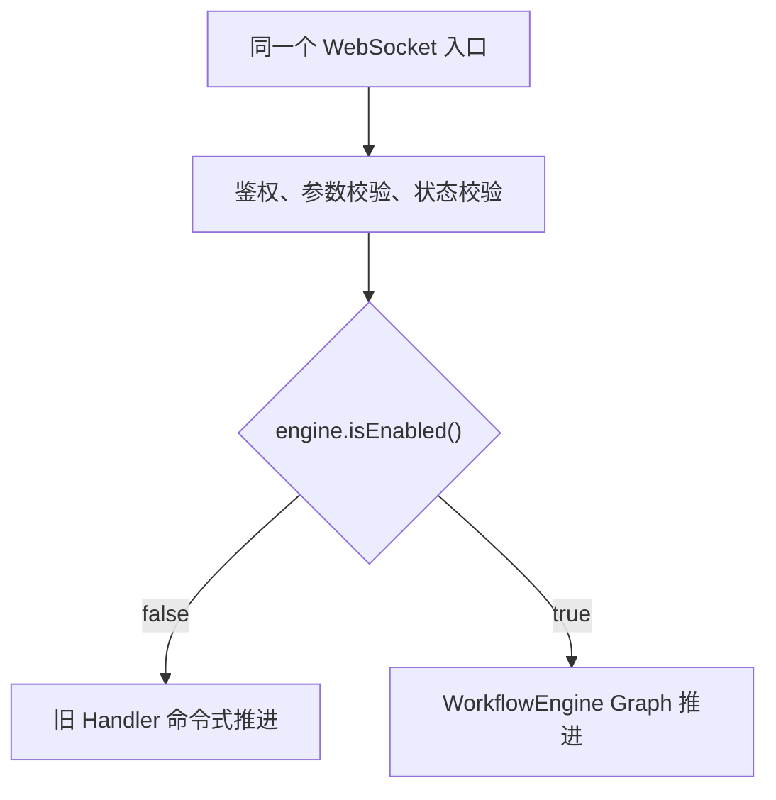
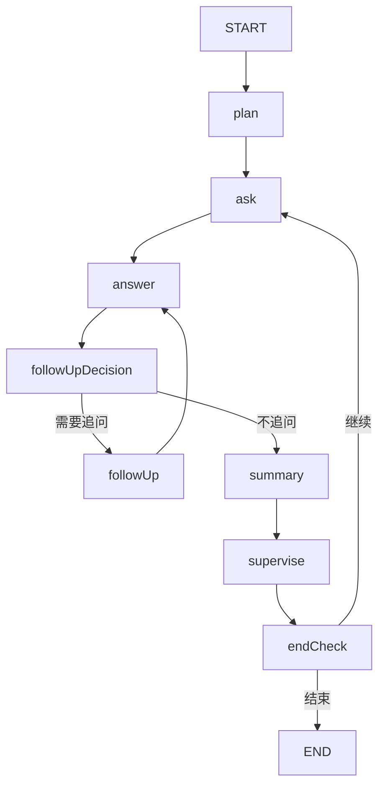
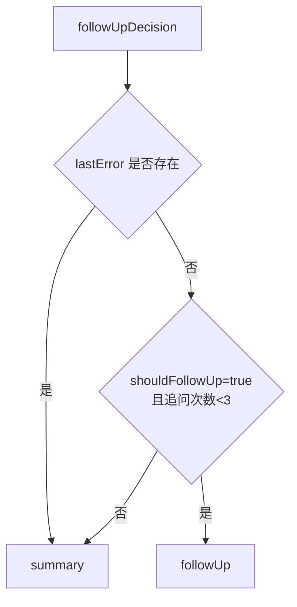
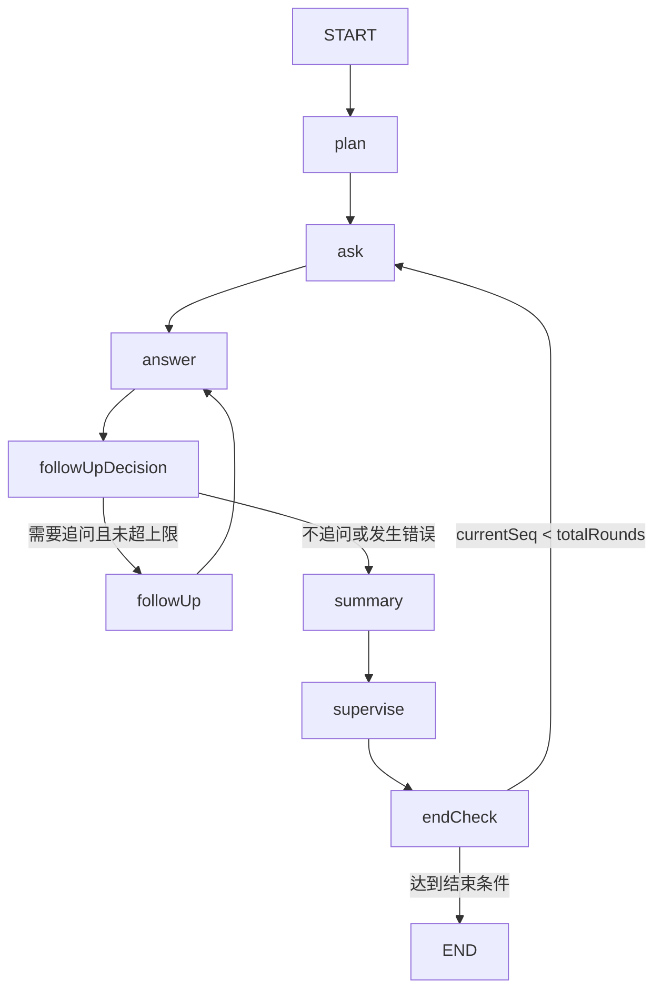
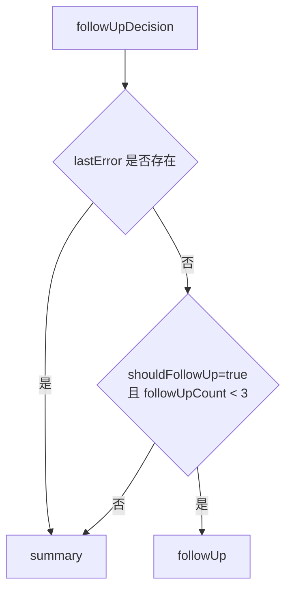
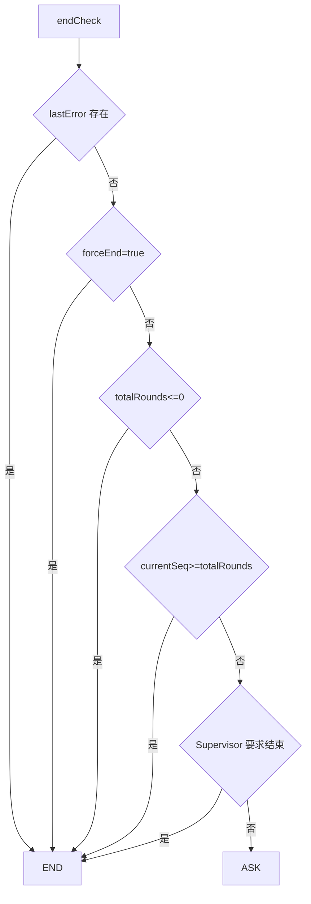
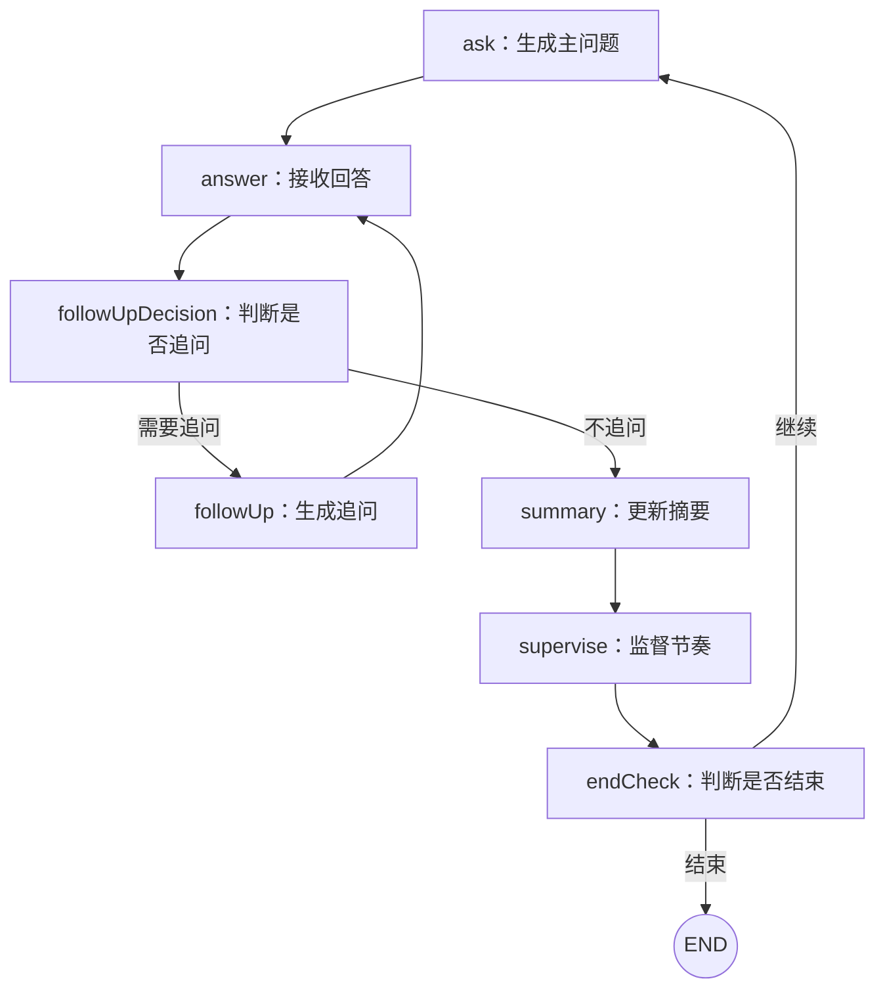
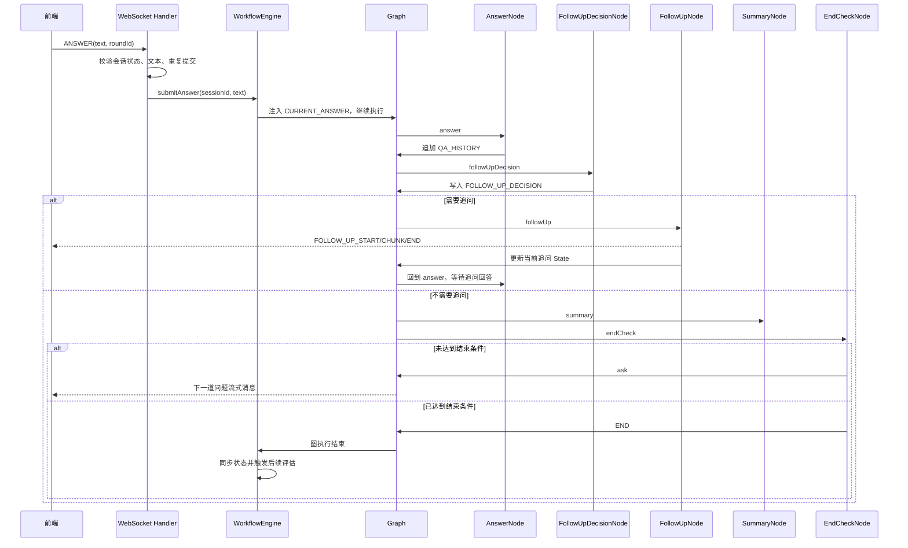

# 第6期：两条链路一张图——LangGraph4j 状态图编排设计方案

## 为什么项目有两条链路
### 两条链路的本质差异
> 业务目标相同，流程推进者不同
- 旧链路：Handler 通过方法调用推进流程
- 新链路：Graph 通过节点和边推进流程


| 维度 | 旧 Handler 链路 | 新 Graph 链路 |
|---|---|---|
| 流程推进者 | Handler 里的 `if/else` 和方法调用 | Graph 的节点、固定边、条件边 |
| 流程状态 | 分散在 DB、Redis、局部变量、会话记忆中 | 集中在 `InterviewState` |
| 等待回答 | 方法执行结束，下一条 WS 消息重新判断进度 | `interruptBefore(answer)` 显式暂停 |
| 恢复方式 | 根据 DB 最后一轮推断下一步 | 从 Redis checkpoint 恢复执行位置 |
| 分支表达 | Java 控制流 | 条件边路由 |
| 容错 | 每个调用点分别处理异常 | 节点统一重试、错误写入 State |
| 可观测性 | 主要看 Handler 日志 | 节点耗时、错误、重试、恢复等指标 |
| 回退方式 | 本身就是旧实现 | 关闭 Engine 开关回到旧实现 |

**Graph 并没有取代 Handler。Handler 仍然负责接收消息、校验输入、识别消息类型和返回结果。Graph 接管的是 Handler 后面的业务编排。**

==旧链路保存的是“业务结果”，新链路额外保存了“流程执行到哪里”。==

### 为什么项目要保留两条链路
这不是架构重复建设，而是为了降低迁移风险。
面试流程不是一个普通的同步请求。它同时涉及：
- WebSocket 长连接
- 流式模型输出
- 用户可能几分钟后才回答
- 动态追问
- 断线重连
- 手动暂停、结束、取消
- Redis checkpoint
- 数据库轮次记录
- Kafka 异步评估和报告
如果一次性删掉旧链路、直接切到 Graph，一旦出现 checkpoint 恢复、重复提交、流式发送或状态同步问题，**就没有快速回退手段。**
因此瓜分Offer采用的是：

这样的好处是：
- 可以逐步验证新链路，而不是“大爆炸式替换”
- 新链路出问题时，只需要关闭配置，不需要紧急回滚代码
- 两条链路共用 WebSocket 协议、数据库表、Agent 和 Kafka 评估链路，迁移成本较低
- 可以用同一批业务测试对比两条链路的行为是否一致。

### 旧链路：Handler 命令式编排
旧链路中代码按照实际执行顺序从上往下书写。读代码时，只要顺着方法调用，就能知道这次请求做了什么，是典型的命令式编排：
```txt
保存回答();

if (需要追问()) {
    生成追问();
    return;
}

if (已经达到题数上限()) {
    结束面试();
} else {
    生成下一题();
}
```

**为什么旧链路早期很好用**
这个是因为我在项目早期只实现了“提问->回答->下一题”，这时候命令式编排是很自然的选择，
早期时有几个明显的优点：
- 调用路径直观
- 不需要引入额外的图模型
- 调试时可以验证调用栈逐步进行
- 新功能可以直接添加一个判断或者方法调用
- 开发速度很快

### 为什么旧链路开始吃力
如果业务始终是`接收请求 → 调用服务 → 保存结果 → 返回响应`这种线性结构，完全没有必要引入 Graph。
问题在于，面试流程后来不再是一次可以在单个方法中执行完的请求。
#### 1. 一条业务流程被分散到了多个入口
首次进入面试间，会进入 `handleReconnectOrStart()`。
提交回答，会进入 `handleAnswer()`。
暂停、结束、取消，又分别进入其他方法。
因此，“面试接下来应该做什么”不再由一个地方决定，而是散落在不同入口中。
例如，生成下一题可能发生在：
- 第一次进入面试间时；
- 回答完成且不需要追问时；
- 再次连接且上一题已经回答时。
**这三个场景做的是同一件事，但进入路径和前置判断不同。随着业务分支增加，需要同时检查多个方法，才能确认“生成下一题”究竟有哪些入口。**

#### 2. Handler必须反推流程执行到了哪里
旧链路没有独立的“当前执行节点”。
一条数据库轮次记录能告诉系统：
- 问题是什么；
- 回答是什么；
- 是主问题还是追问。
但它不能直接告诉系统：
- 当前应该等待回答；
- 当前应该判断追问；
- 当前应该生成下一题；
- 当前已经准备结束。
因此 Handler 需要根据业务结果反推流程位置。
连接建立时的旧链路就包含一组典型推断：
```txt
没有轮次记录
→ 认为这是首次开始，生成首题

最后一轮没有回答
→ 认为正在等待回答，重新发送当前问题

最后一轮已经回答，并且没有达到题数上限
→ 认为应该生成下一题

最后一轮已经回答，并且达到题数上限
→ 认为应该结束
```
这些判断本身没有错，但说明数据库保存的是已经发生的业务事实，Handler 还要根据这些事实推断程序下一步该执行什么。
> 旧链路保存了业务数据，却没有显式保存“程序计数器”，只能根据业务结果反推。

#### 3. 传输层逐渐承担了流程编排职责
Handler最开始应该关注：收到什么消息 → 消息是否合法 → 应该交给谁处理 → 返回什么响应
但在旧链路里，它还需要负责：
- 查询并判断当前轮次；
- 组装 Agent 上下文；
- 调用面试官 Agent；
- 判断是否追问；
- 创建主问题或追问记录；
- 判断是否达到结束条件；
- 决定下一步调用哪个方法。
这会让“协议处理”和“业务流程”**耦合在同一个类**中。
**这样就会导致修改流程时需要改 Handler；修改 Handler 时又可能影响通信行为。两种变化拥有不同的原因，却集中在同一个类里。**

#### 4. 分支不是简单增加，而是相互组合
如果单独看每个需求，可能只增加一个 if：
```txt
是否追问？
是否达到题数上限？
是否手动结束？
是否为重新连接？
当前问题是否已经回答？
```
真正让代码变复杂的不是判断数量，而是这些条件会组合。
例如，“连接建立”不再只是建立连接，而是还要判断：
```txt
首次进入还是重新进入？
当前是否有问题？
问题是否已经回答？
是否已经达到上限？
接下来生成问题还是结束？
```
当一个新状态加入后，通常不只需要修改一个地方，而是要检查所有可能推进流程的入口。

#### 5. 业务与流程跳转难以分开测试
在旧链路中，“保存回答”“判断追问”和“选择下一步”通常处于同一个方法里。
如果只想验证 `shouldFollowUp = true 且追问次数未达上限 → 应该进入追问流程`
测试往往还需要准备数据库轮次、会话状态、Agent 返回结果和 WebSocket Session。
问题不在于旧链路不能测试，而在于业务动作与路由选择没有天然的隔离边界。


### 新链路：LangGraph4j Engine
**新链路没有删除 Handler，而是重新划分了职责:**
- Handler：接收外部事件
- Engine：把外部事件转换成图执行
- Graph：决定节点执行顺序
- Node：完成一个具体业务动作
- State：保存节点需要共享的数据

#### 1. Handler由流程导演改为入口适配器
启用 Engine 后，Handler 收到回答时，不再亲自执行：保存回答 -> 判断追问 -> 判断是否结束 -> 生成下一题
而是把回答交给Engine：
```java
engine.submitAnswer(sessionId, text);
```
新链路里，Handler 只需要关心：
- 消息类型是不是 ANSWER；
- 会话状态是否允许回答；
- 回答内容是否合法；
- Engine 调用成功还是失败；
- 如何把结果返回给客户端。
至于回答之后进入追问、摘要、下一题还是结束，**由 Graph 决定**。

#### 2. Engine 是外部与状态图的边界
`InterviewWorkflowEngine` 并不是一个新的业务节点，它是状态图的应用层门面。
它向 Handler 提供面向业务的操作，例如：
```java
startInterview(sessionId);
submitAnswer(sessionId, answer);
finishInterview(sessionId);
pauseInterview(sessionId);
cancelInterview(sessionId);
```
如此一来，Handler 不需要了解 LangGraph4j 如何编译图，也不需要直接操作图节点。
这样的好处是：
> WebSocket 层使用的是“开始面试、提交回答”这样的业务语言，而不是“调用某个节点、指定某条边”这样的图框架语言。

#### 3. Node 只完成当前动作，不决定下一步
Graph 中的节点遵循同一种工作方式：读取 InterviewState → 执行当前业务 → 返回状态更新
例如：
- PlanNode：准备面试计划和题数。
- QuestionNode：生成当前主问题。
- AnswerNode：把当前回答加入问答历史。
- FollowUpDecisionNode：产出追问决策。
- FollowUpNode：生成追问问题。
- SummaryNode：更新阶段性摘要。
- SuperviseNode：对当前节奏进行监督；开关关闭时直接透传。
- EndCheckNode：提供显式的结束判断位置。
> 节点只报告“做完以后状态发生了什么变化”，不在节点内部直接调用下一个节点。
例如 `AnswerNode` 不需要知道回答后应该追问还是进入下一题。它只负责把回答写入 `QA_HISTORY`。之后执行哪个节点，由图上的边决定。

#### 4. Edge 把隐藏在 if/else 中的流程显式化
新链路的图如下：

这里包含两类边：
- 固定边：无条件的执行顺序：
```txt
plan → ask
ask → answer
answer → followUpDecision
```
- 条件边：根据State选择下一个节点：
```txt
followUpDecision → followUp 或 summary
endCheck → ask 或 END
```

#### 5. InterviewState 是节点之间的数据总线
节点被拆开以后，需要一种统一方式传递数据，这就是 `InterviewState`
`InterviewState` 保存了会话元数据、面试计划信息、当前轮次信息、流程决策信息、累计数据。
```txt
会话元数据
├─ sessionId
├─ candidateName
├─ positionTitle
└─ persona

面试计划
├─ interviewPlan
└─ totalRounds

当前轮次
├─ currentSeq
├─ currentQuestion
├─ currentAnswer
└─ currentRoundId

流程决策
├─ followUpDecision
├─ followUpCount
├─ forceEnd
└─ lastError

累积数据
├─ qaHistory
└─ questionsAsked
```
这样一来，`QuestionNode` 不需要重新从 Handler 接收一长串参数；`FollowUpDecisionNode` 也不需要知道上一个节点是谁。它们只需要读取 State 中约定好的字段。
**State 还明确区分两种更新语义：**
- Replace：新值覆盖旧值，适合 currentQuestion、currentAnswer 等当前态。
- Append：新值追加到集合，适合 qaHistory、questionsAsked 等历史数据。
节点只需要返回本次更新：
```java
return Map.of(
    InterviewState.CURRENT_ANSWER, answer,
    InterviewState.QA_HISTORY, qaPair
);
```

#### 6. Graph 解决的是流程归属
旧链路中，想要知道完整面试的流程，需要阅读Handler的多个方法。
而在新链路中，则是：
想要知道面试怎么走，先看`InterviewGraphFactory`；
想知道某一步具体做了什么，再进入对应的**Node**；
想知道节点之间传递什么，再看`InterviewState`


## InterviewGraphFactory：这张图是如何创建出来的
`InterviewGraphFactory` 是新链路的“流程装配器”。
它不负责具体生成问题，也不负责调用追问 Agent，而是负责把这些已经存在的 Node 按照面试业务顺序连接起来，最终得到一张可以执行的 LangGraph4j 状态图。
**InterviewGraphFactory 的职责**
1. 创建 Graph 容器；
2. 注册所有业务节点；
3. 添加固定边和条件边；
4. 将 Graph 编译成 CompiledGraph。
不负责：
- 生成面试计划；
- 生成问题；
- 判断回答内容；
- 直接保存数据库；
- 处理 WebSocket 消息。
这些事情由 Node、Engine、StatePersistenceService 和 Handler 完成。

### 1. 创建StateGraph容器
```java
public StateGraph<InterviewState> buildGraph() throws Exception {
    StateGraph<InterviewState> graph =
            new StateGraph<>(InterviewState.SCHEMA, InterviewState::new);

    // 后续注册节点和边

    return graph;
}
```
**`InterviewState.SCHEMA` 说明图的所有节点都共享`InterviewState`。**
Node 不再通过方法参数传递大量上下文，而是直接从 State 中读取以下数据：
```txt
sessionId
candidateName
positionTitle
interviewPlan
currentQuestion
currentAnswer
qaHistory
followUpDecision
totalRounds
lastError
```
> Graph 负责推进流程，InterviewState 负责携带流程数据。 

### 2. 注册节点
Graph 创建出来之后，第一件事是把业务 Node 注册进去。
```java
graph.addNode(NodeNames.PLAN, async(wrap(planNode, 2, 1000)));
graph.addNode(NodeNames.ASK, async(wrap(questionNode, 2, 2000)));
graph.addNode(NodeNames.ANSWER, async(wrap(answerNode, 1, 0)));
graph.addNode(NodeNames.FOLLOW_UP_DECISION,async(wrap(followUpDecisionNode, 3, 500)));
graph.addNode(NodeNames.FOLLOW_UP, async(wrap(followUpNode, 2, 2000)));
graph.addNode(NodeNames.SUMMARY, async(wrap(summaryNode, 2, 1000)));
graph.addNode(NodeNames.END_CHECK, async(wrap(endCheckNode, 1, 0)));
``` 
如果 `SuperviseNode` 被注入，还会额外注册：
```java
graph.addNode(
        NodeNames.SUPERVISE,
        async(wrap(superviseNode, 2, 1000)));
```
| 节点 | 作用 |
|---|---|
| `plan` | 准备面试计划 |
| `ask` | 生成主问题 |
| `answer` | 接收并记录回答 |
| `followUpDecision` | 判断是否需要追问 |
| `followUp` | 生成追问问题 |
| `summary` | 更新阶段性摘要 |
| `supervise` | 评估面试节奏 |
| `endCheck` | 提供结束判断出口 |

#### 为什么注册时还要包一层 FaultTolerantNode
在项目里，Graph 注册的不是裸 Node，而是类似于`async(wrap(questionNode, 2, 2000))`
这实际上经过了两层包装：
**第一层：`FaultTolerantNode`：**
```java
wrap(questionNode, 2, 2000)
```
表示`questionNode` 是一个故障容忍节点，最多重试 2 次，每次重试间隔 2000ms。
`FaultTolerantNode` 负责：
- 捕获节点异常
- 根据配置重试
- 使用指数退避
- 重试耗尽后将错误写入`InterviewState`

**第二层：异步接口适配：async**
```java
private AsyncNodeAction<InterviewState> async(
        NodeAction<InterviewState> node) {
    return AsyncNodeAction.node_async(node);
}
```
项目中的业务 Node 主要实现的是同步接口：`NodeAction<InterviewState>`
而 LangGraph4j 的 Graph 注册接口使用：`AsyncNodeAction<InterviewState>`
因此`async()`的作用是做接口适配：业务 Node → FaultTolerantNode → AsyncNodeAction → 注册到 Graph。这也是 GraphFactory 的一个重要职责，即把业务代码适配成 Graph 框架需要的形式。

### 3. 添加固定边
节点注册完成后，Graph 还不知道节点之间如何连接，所以需要添加固定边。
```java
graph.addEdge(START, NodeNames.PLAN);
graph.addEdge(NodeNames.PLAN, NodeNames.ASK);
graph.addEdge(NodeNames.ASK, NodeNames.ANSWER);
graph.addEdge(NodeNames.ANSWER, NodeNames.FOLLOW_UP_DECISION);
```
这几条边表达的是确定性流程：START -> PLAN -> ASK -> ANSWER -> FOLLOW_UP_DECISION
它们的特点是：
> 当前节点执行完成后，不需要额外判断，必然进入下一个节点。

### 4. 添加第一条条件边
固定边只能描述确定性的流程，追问判断需要条件边。
```java
EdgeAction<InterviewState> followUpRouter =
        this::routeAfterFollowUpDecision;

graph.addConditionalEdges(
        NodeNames.FOLLOW_UP_DECISION,
        AsyncEdgeAction.edge_async(followUpRouter),
        Map.of(
                NodeNames.FOLLOW_UP, NodeNames.FOLLOW_UP,
                NodeNames.SUMMARY, NodeNames.SUMMARY));
```
**1. 指定从哪个节点开始判断**
`NodeNames.FOLLOW_UP_DECISION` 表示 followUpDecision 执行完成后才开始进行条件路由
**2. 指定由哪个 Router 做判断**
`this::routeAfterFollowUpDecision` 表示调用`routeAfterFollowUpDecision(state)`  
**3. 指定返回值和目标节点的映射**
```java
Map.of(
    NodeNames.FOLLOW_UP, NodeNames.FOLLOW_UP,
    NodeNames.SUMMARY, NodeNames.SUMMARY)
```
Router 返回 "followUp" → 进入 followUp 节点
Router 返回 "summary"  → 进入 summary 节点

**路由规则**
```java
String routeAfterFollowUpDecision(InterviewState state)
        throws Exception {
    if (state.lastError() != null) {
        return NodeNames.SUMMARY;
    }

    FollowUpDecision decision =
            state.followUpDecision();

    if (decision != null
            && decision.shouldFollowUp()
            && state.followUpCount()
                    < MAX_FOLLOW_UPS_PER_QUESTION) {
        return NodeNames.FOLLOW_UP;
    }

    return NodeNames.SUMMARY;
}
```  
**翻译成流程图就是：**


### 5. 添加第二条条件边
结束判断同样不是固定路径。
面试可能：
- 还没有达到题数上限；
- 已经达到题数上限；
- 被手动结束；
- 出现错误；
- 被总指挥提前结束。
因此 endCheck 后需要条件路由：
```java
EdgeAction<InterviewState> endCheckRouter =
        this::routeAfterEndCheck;

graph.addConditionalEdges(
        NodeNames.END_CHECK,
        AsyncEdgeAction.edge_async(endCheckRouter),
        Map.of(
                GraphDefinition.END,
                GraphDefinition.END,
                NodeNames.ASK,
                NodeNames.ASK));
```
**路由规则**
```java
String routeAfterEndCheck(InterviewState state)
        throws Exception {
    if (state.lastError() != null) {
        return END;
    }

    if (state.forceEnd()) {
        return END;
    }

    if (state.totalRounds() <= 0) {
        log.error(
                "totalRounds<=0 异常，按配置错误终止 sessionId={} seq={}",
                state.sessionId(),
                state.currentSeq());
        return END;
    }

    if (state.currentSeq() >= state.totalRounds()) {
        return END;
    }

    if (state.supervisorDecision() != null
            && state.supervisorDecision().action()
                    == SupervisorAction.END) {
        return END;
    }

    return NodeNames.ASK;
}
```

**翻译成流程图就是：**

这里的各个判断条件分别是：
- lastError:如果某个 Node 多次重试后仍然失败，错误会写进`InterviewState.LAST_ERROR`,结束路由发现错误后，不再继续生成新问题
- forceEnd:用户主动发送结束操作时，Engine 会向 State 注入`FORCE_END = true`
- totalRounds <= 0:正常面试必须有至少一题，如果`totalRounds <= 0`，说明当前 State 存在配置或数据异常，这里不会把它当成正常流程继续，而是记录错误日志并结束。
- currentSeq >= totalRounds:如果`currentSeq >= totalRounds`，说明当前面试已经达到了题数上限，这里会返回`END`，结束路由。
- Supervisor 要求结束:如果总指挥节点判断当前面试需要提前结束`state.supervisorDecision().action() == SupervisorAction.END`,也会进入END路由。

### 完整的 buildGraph() 做了什么
把前面的步骤合起来，buildGraph() 的执行逻辑就是：
1. 创建 StateGraph
2. 注册 8 个业务节点
3. 给节点统一包上 FaultTolerantNode
4. 添加 START、plan、ask、answer 等固定边
5. 添加 followUpDecision 条件边
6. 添加 endCheck 条件边
7. 返回未编译的 StateGraph

**完整的拓扑：**


### 6. 把 Graph 编译成可执行对象
buildGraph() 返回的只是图定义，还不能真正执行,因此还需要编译。
**1. 无 Checkpoint 编译**
```java
public CompiledGraph<InterviewState>
        compileWithoutCheckpoint()
        throws Exception {
    CompileConfig config =
            CompileConfig.builder()
                    .recursionLimit(100)
                    .build();

    return buildGraph().compile(config);
}
```
这个方法主要用于：
- Graph 单元测试；
- Graph 集成测试；
- 验证拓扑是否正确；
- 不依赖 Redis 的本地执行。

**2. 带 Checkpoint 编译**
```java
public CompiledGraph<InterviewState> compile(
        BaseCheckpointSaver checkpointer)
        throws Exception {
    CompileConfig config =
            CompileConfig.builder()
                    .checkpointSaver(checkpointer)
                    .recursionLimit(100) //Graph 在一次执行过程中允许经过的最大节点步数。
                    .build();

    return buildGraph().compile(config);
}
```
这个方法在 Engine 中使用，用于正式运行带持久化能力的 Graph。

==Checkpoint 相关的后面期会详细讲解==

### 为什么要单独设置 EndCheckNode
EndCheckNode 本身没有复杂业务逻辑：
```java
@Override
public Map<String, Object> apply(
        InterviewState state) {
    log.debug(
            "[{}] session={} seq={}/{}",
            nodeName(),
            state.sessionId(),
            state.currentSeq(),
            state.totalRounds());

    return Map.of();
}
```
它主要是一个“显式判断点”。
你可能会问，为什么不直接从 summary 添加条件边？
当然也可以，但单独保留 endCheck 可以让流程结构更加清楚：
- summary 负责摘要；
- supervise 负责监督；
- endCheck 负责提供结束判断出口；
- Router 负责决定 ASK 还是 END。
如果把所有逻辑都塞到 summary 后面，摘要节点就会同时承担：摘要、判断结束、判断错误、判断是否继续。
职责会再次变重。
所以 EndCheckNode 虽然是一个透传节点，但它让流程图中出现了一个清晰的决策边界。
> 这里不是在做业务动作，而是在决定流程是否继续。


## InterviewWorkflowEngine 如何使用这个工厂
InterviewWorkflowEngine 在初始化时编译 Graph：
```java
@Autowired
public void setCompiledGraph()
        throws Exception {
    this.compiledGraph =
            graphFactory
                    .compileWithInterruptBeforeAnswer(
                            checkpointSaver);
}
```
Engine 不需要自己重新拼接节点和边，只需要：**从 GraphFactory 获取已经编译好的 Graph → 传入初始 State → 调用 Graph 执行**


## 一次回答如何经过整张 Graph
候选人看到问题时，Graph 已经执行过：plan -> ask
QuestionNode 已经完成了：
- 调用面试官 Agent 生成问题；
- 将问题流式发送给前端；
- 更新 currentQuestion；
- 更新 currentSeq；
- 清空 currentAnswer；
- 将追问相关字段重置为主问题状态。
此时 State 大致如下：
```txt
currentSeq       = 2
currentQuestion  = "请介绍一下你在项目中负责的核心模块"
currentAnswer    = ""
pendingFollowUp = false
followUpCount   = 0
qaHistory       = [第 1 轮问答]
```
此时Graph的下一步是answer，但是此时候选人还没有回答，所以 Graph 不会继续执行 AnswerNode，而是停在回答入口之前，等待外部消息。

### 1. Handler 接收回答
前端发送一条回答消息：
```json
{
  "type": "ANSWER",
  "text": "我主要负责订单模块的拆分和性能优化",
  "roundId": 102
}
```
消息首先进入：`InterviewWebSocketHandler.handleAnswer(...)`
Handler 先做通信层和入口层校验:
- 校验会话状态：只有`IN_PROGRESS`状态的会话才能提交回答
- 校验回答内容：回答内容不能为空、回答内容不能超过最大长度、拒绝重复提交（判断 roundId 是否已经有回答）
然后Handler 将回答交给 Engine 执行。

### 2. Engine 将回答注入 Graph State
`InterviewWorkflowEngine.submitAnswer(...)` 首先根据 sessionId 找到当前 Graph 执行上下文。
核心逻辑是：
```java
InterviewState pausedState =
        loadStateFromCheckpoint(config);
```
如果没有找到当前状态，Engine 无法确定这个回答对应哪一个问题，就会拒绝处理：
```java
throw new IllegalStateException(
        "无 checkpoint，无法提交回答");
```
找到当前状态后，Engine 将回答作为 State 更新注入：
```java
compiledGraph.invoke(
        GraphInput.resume(
                Map.of(
                    InterviewState.CURRENT_ANSWER,
                    answer)),
        config);
```
这里最重要的是：`InterviewState.CURRENT_ANSWER`，回答不是直接传给 AnswerNode 的 Java 方法参数，而是先写入 Graph State。
注入后，State 从：`currentAnswer = ""`变成：`currentAnswer = "我主要负责订单模块的拆分和性能优化"`
然后 Graph 从当前等待位置继续执行。

### 3. AnswerNode 接收回答
AnswerNode 不调用 Agent，也不决定下一步路径，它只负责把当前回答转成一条问答记录。
```java
String answer = state.currentAnswer();

if (answer == null || answer.isBlank()) {
    throw new IllegalStateException(
            "AnswerNode 收到空回答");
}
```
如果是主问题，则构造普通回答：
```java
new QaPair(
    state.currentSeq(),
    state.currentQuestion(),
    answer
);
```
如果是追问，则需要额外记录：主问题序号、追问问题、追问回答、追问序号、追问类型。然后返回State。增量：
```java
return Map.of(
    InterviewState.QA_HISTORY,
    qaPair
);
```
**AnswerNode 并不直接修改整个 State，也不直接写数据库，只返回本次新增了一条 QA_HISTORY，然后由InterviewState 中定义的Append Channel 把这条记录追加到历史中。**
这里有一个重要规则：
> 追问会追加到问答历史，但不会增加主问题序号。
例如：
```txt
主问题 seq = 2
追问 parentSeq = 2
追问不会变成 seq = 3
```
这样主问题数量和追问数量可以分开统计。

### 4. 进入 FollowUpDecisionNode
AnswerNode 执行完成后，Graph 沿着固定边`answer → followUpDecision`继续，这条边不需要条件判断，因为每个有效回答都必须先经过追问决策。
FollowUpDecisionNode 会从 State 中读取当前问答上下文：
```txt
sessionId
resumeId
currentRoundId
currentQuestion
currentAnswer
candidateName
positionTitle
jdText
resumeSummary
followUpHints
questionsAsked
persona
```
然后组装FollowUpContext，并调用followUpAgent.evaluate(context)
Agent 返回一个追问决策，例如：
```java
FollowUpDecision(
    shouldFollowUp = true,
    followUpType = DEEPEN,
    reason = "回答提到了性能优化，但缺少具体指标"
)
```
FollowUpDecisionNode 将决策写入 State 的`FOLLOW_UP_DECISION`,如果决策中包含简历矛盾点，也会同步写入`CONFLICT_DETAILS_BY_ROUND`,但是它仍然不会直接调用 FollowUpNode。
> FollowUpDecisionNode 只负责产生追问决策：是否追问、追问类型、追问原因、是否包含简历矛盾点。

### 5. 条件边选择下一条路径
Graph到达followUpDecisionNode后，不再走固定边，而是调用`routeAfterFollowUpDecision(state)`。
路由规则：

> 因此是Node 产生 State → 条件边读取 State → Graph 选择下一个 Node

### 6. 需要追问时走回环路径
如果路由结果是`followUp`，Graph执行`followUpDecision -> followUp`
1. **FollowUpNode 从 State 中读取追问决策，然后组装上下文，调用followUpAgent.streamFollowUp(...)**
2. 追问问题流式发送：FollowUpNode 会通过 StreamEmitter 向前端发送：`FOLLOW_UP_START、FOLLOW_UP_CHUNK、FOLLOW_UP_END`，同时将所有chunk拼接成完整追问：`String question = full.toString().trim()`
3. FollowUpNode 更新 State:追问生成后，节点会更新State；
4. FollowUpNode 回到 answer：Graph 中有一条固定边`followUp → answer`，因此追问生成后，流程不是直接进入下一道主问题，而是回到`answerNode`,形成回环`answer -> followUpDecision -> followUp -> answer`
> 追问和主问题的回答，使用同一个 AnswerNode 处理
主问题回答和追问回答的区别，不靠两套 AnswerNode，而是由 State 中的：
```txt
pendingFollowUp
parentSeq
followUpIndex
followUpType
```

### 7. 不需要追问时走摘要和结束判断路径
如果路由结果是`summary`，Graph执行`followUpDecision -> summary`
1. **SummaryNode 更新阶段性摘要**
`SummaryNode`读取`QA_HISTORY、RUNNING_SUMMARY、LAST_SUMMARIZED_INDEX`来判断当前是否已经积累了足够多、尚未摘要的问答记录。
如果没有达到摘要阈值则返回空更新，如果达到阈值则调用`summaryAgent.summarize(context)`生成摘要，并更新`RUNNING_SUMMARY、LAST_SUMMARIZED_INDEX、LAST_SUMMARIZED_SEQ`
摘要完成或跳过后，流程都会继续向结束判断节点前进。

2. **进入 SuperviseNode**
SuperviseNode 读取当前面试状态，计算：
```txt
已耗时
当前主问题序号
总题数
已回答主问题数
追问数量
平均评分
```
然后产生一个监督决策，后面会详细讲这个，目前只做了解即可。

3. 进入 EndCheckNode
EndCheckNode 本身不负责修改业务数据，它主要是一个显式的判断出口。

### 8. endCheck 决定继续还是结束
endCheck 执行完成后，Graph 调用：`routeAfterEndCheck(state)`
会按照优先级检查结束条件：


### 9. 走向下一题,Graph 形成主循环
如果结束判断结果是ask，Graph通过条件边回到ask，然后流程再次执行：`ask -> answer -> followUpDecision -> followUp/summary -> supervise -> endCheck`
一轮主问题的完整循环：


## Graph 执行结束后，Engine 做什么
Graph 走到下一个 ask 或 END 后，`InterviewWorkflowEngine` 会读取最新 State：
```java
InterviewState newState =
        loadStateFromCheckpoint(config);
```
然后同步到数据库：
```java
statePersistenceService.syncFromState(
        sessionId,
        newState);
```
因此一次回答结束后，系统会完成两类更新：
1. **Graph 内部状态更新**
```txt
currentAnswer
qaHistory
followUpDecision
followUpCount
currentQuestion
currentSeq
runningSummary
lastError
```
2. **外部持久化更新**
```txt
当前轮次回答
新生成的问题
追问关系
面试状态
摘要信息
```
如果 Graph 走到了 END，Engine 还会触发后续评估流程。


## 一次回答的完整时序图

