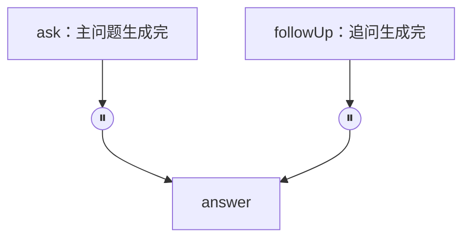
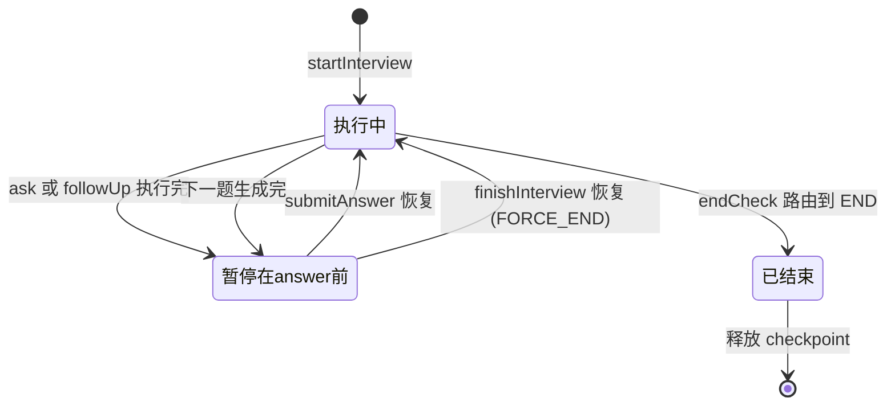
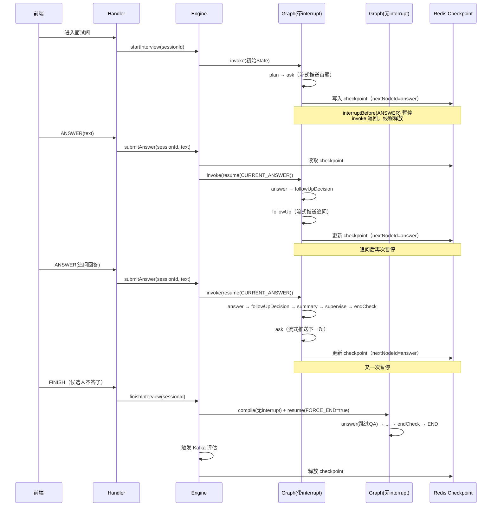

# 第7期：一停一续——LangGraph4j 打断与恢复机制设计方案

第6期回答的问题是：**流程怎么串起来**——节点、边、State 如何把一场面试组织成一张图。
但那张图里有一个当时被一句话带过的动作：

> Graph 执行到 ASK 节点后，会在进入 ANSWER 之前暂停。

这一期专门回答三个问题：

- 图是怎么**停下来**的？停下来之后，"执行到了哪里"存在哪？
- 候选人几分钟后提交回答，图是怎么**接着跑**的？
- 候选人不回答了、直接点结束，图又怎么收尾？

==面试的本质是人机交替发言。打断与恢复机制，就是把"等人说话"这件事从线程的等待，变成状态的持久化。==

## 面试为什么必须"停下来"

### 普通 Graph 是一口气跑完的

LangGraph4j 默认的执行模型非常简单：

```txt
invoke(初始State)
    ↓
START → plan → ask → answer → followUpDecision → ... → END
    ↓
返回最终State
```

一次 `invoke`，线程从头跑到尾，中间不停止。

对于"输入在启动时就已经备齐"的流程（比如批量生成一份报告），这没有问题。
但面试不是。看这张图上每个节点的输入来源：

| 节点                 | 输入来自哪里        | 何时可用           |
| ------------------ | ------------- | -------------- |
| plan               | 数据库（简历、JD、配置） | 启动前            |
| ask                | 上一个节点 + Agent | 执行中            |
| **answer**         | **候选人键盘输入**   | **几分钟后，甚至永远不** |
| followUpDecision   | State 中的问答记录  | 执行中            |
| summary / endCheck | State         | 执行中            |

answer 是全图唯一一个**依赖外部人类事件**的节点。
如果图不停下来，它要么拿着一个空回答继续跑，要么在 answer 里死等。

### 等待人类输入，线程等不起

最朴素的思路是让线程等待：

```txt
ask 生成问题
    ↓
线程 sleep / wait，直到候选人回答
    ↓
answer 继续执行
```

这条路在面试场景有三个致命问题：

1. **等的时间不可控**：候选人可能思考 30 秒，也可能离开 10 分钟。一个面试间挂起一个线程，一千个并发面试就是一千个干等的线程。
2. **服务重启就丢**：线程内存里的等待状态不落盘，重启后"当前停在哪一题"直接丢失。
3. **连接不可靠**：WebSocket 可能断线重连，等待不能绑定在某一条连接上。

### 需要的语义

所以项目真正需要的是一种**持久化的暂停**：

```txt
执行到 answer 之前
    ↓
把"执行到哪了 + 当前全部状态"写入 Redis
    ↓
invoke 方法直接返回，线程归还容器
    ↓
（几分钟后，可能是另一个线程、另一台机器）
外部事件到达 → 从 Redis 恢复 → 从暂停点继续执行
```

注意关键点：**暂停后线程是释放的，恢复时可以用完全不同的线程**。
这就是 `interruptBefore` + checkpoint 要做的事。

## 打断点声明在哪里：interruptBefore(ANSWER)

### 代码只有一行

第6期讲过，Engine 初始化时编译 Graph：

```java
@Autowired
public void setCompiledGraph() throws Exception {
    this.compiledGraph = graphFactory.compileWithInterruptBeforeAnswer(checkpointSaver);
}
```

进入 `InterviewGraphFactory`，打断点的真身只是编译配置里的一项：

```java
public CompiledGraph<InterviewState> compileWithInterruptBeforeAnswer(
        BaseCheckpointSaver checkpointer) throws Exception {
    CompileConfig.Builder builder =
            CompileConfig.builder()
                    .recursionLimit(100)
                    .interruptBefore(NodeNames.ANSWER);   // 就是这一行
    if (checkpointer != null) {
        builder.checkpointSaver(checkpointer);
    }
    return buildGraph().compile(builder.build());
}
```

这一行的含义是：

> Graph 每次执行、只要即将进入 answer 节点，就先暂停，把当前 State 写入 checkpoint，然后 invoke 返回。

注意三个细节：

1. **打断声明在编译期，不是运行期**。它不是某个节点里的 `Thread.sleep`，也不是 Handler 里的判断，而是图本身的属性。同一份 `buildGraph()` 拓扑，编不编这个配置，行为完全不同。
2. **interruptBefore 是节点级声明**。它管的是"进入 answer 之前"这个位置，不关心从哪条边进来。
3. **每次执行到该位置都会停**。不是只停第一次，而是整场面试中反复生效

### 为什么是 answer 之前，而不是 ask 之后

"在 ask 执行完之后暂停"和"在 answer 执行之前暂停"，看起来是同一个位置，语义却有差别：

| 维度   | interruptAfter(ASK)    | interruptBefore(ANSWER) |
| ---- | ---------------------- | ----------------------- |
| 声明单位 | 边（ask 的出边之后）           | 节点（answer 的入口）          |
| 生效范围 | 只对 ask → answer 这条路径生效 | **所有指向 answer 的入边都生效**  |
| 语义   | "ask 做完了，歇一下"          | "answer 需要人类输入，必须停"     |

### 两条入边，一个打断点

answer 有**两条入边**：



* 主问题路径：`ask → answer`

* 追问回环：`followUp → answer`

如果打断点声明在边上，就要声明两次：ask 之后停一次，followUp 之后再停一次，而且两处暂停的语义还得保持一致——漏掉一处，追问回答就会被 answer 节点当成空回答处理。
而 `interruptBefore(ANSWER)` 是**节点级**的：不管从哪条边进入 answer，都在入口处暂停。

```java
// 追问回环：followUp 生成追问问题后回到 ANSWER 等待候选人回答
// （interruptBefore(ANSWER) 为节点级中断，ask→answer 与 followUp→answer 两条入边均会暂停）
graph.addEdge(NodeNames.FOLLOW_UP, NodeNames.ANSWER);
```

这和第6期讲过的设计是配套的：**主问题和追问共用同一个 AnswerNode**，区别靠 State 中的 `pendingFollowUp`、`parentSeq` 等字段表达。
节点共用，打断点也共用。一次声明，两处生效，不会漏。

> 打断点选在 answer，不是因为 answer 的代码重要，而是因为 answer 的**输入来自人类**。打断点是围着一类特殊节点设计的：等待外部事件的节点。

## 第一次暂停：startInterview

### 从一次完整执行说起

面试开始时，Handler 调用：

```java
engine.startInterview(sessionId);
```

Engine 内部：

```java
public boolean startInterview(Long sessionId) throws Exception {
    RunnableConfig config = newConfig(sessionId);   // threadId = sessionId

    // 幂等：已有 checkpoint 直接复用，不重跑
    InterviewState existing = loadStateFromCheckpoint(config);
    if (existing != null) { ... return false; }

    // 构建初始 State（会话、计划、题数、简历摘要等）
    InterviewState initial = statePersistenceService.buildInitialState(sessionId);

    // 执行：plan → ask，然后在 answer 之前暂停
    compiledGraph.invoke(initial.data(), config);

    // 暂停后，从 checkpoint 读回最新 State，同步到数据库
    InterviewState pausedState = loadStateFromCheckpoint(config);
    if (pausedState != null) {
        statePersistenceService.syncFromState(sessionId, pausedState);
    }
    ...
}
```

这段代码里最容易被忽略、也最关键的一行是：

```java
compiledGraph.invoke(initial.data(), config);
```

它看起来只是"执行图"，但执行到 answer 之前，框架做了三件事：

```txt
1. plan 节点执行（准备计划）
2. ask 节点执行（调用 Agent 生成首题，流式推给前端）
3. 即将进入 answer → 触发 interruptBefore：
   ├─ 把当前完整 State 序列化成 Checkpoint
   ├─ 经 checkpointSaver 写入 Redis
   └─ invoke 返回（此时图没有走到 END）
```

\==**暂停不抛异常，不阻塞，invoke 直接返回**。Engine 拿不到"最终结果"，于是转而从 checkpoint 把暂停态读回来，完成落库。==
调用方如果想确认暂停位置，可以通过 `stateOf(RunnableConfig)` 读取 next 节点——Engine 的做法等价：读 checkpoint。

此时线程已经归还，前端在答题，Redis 里躺着一份完整的"现场"。

### 暂停时 Redis 里存了什么

`RedisCheckpointSaver` 的存储结构：

```txt
interview:checkpoint:{threadId}              → String (JSON)  最新 checkpoint
interview:checkpoint:{threadId}:history      → List  (JSON)  checkpoint 历史（可选）
TTL：默认 24h
```

threadId 就是 sessionId，**一场面试一个 key**。Checkpoint 里最核心的四个字段：

| 字段             | 含义                | 在恢复中的作用            |
| -------------- | ----------------- | ------------------ |
| `nodeId`       | 刚执行完的节点           | 说明"谁刚做完"           |
| `nextNodeId`   | 下一个要执行的节点         | **恢复的起点，相当于程序计数器** |
| `state`        | 全量 InterviewState | 恢复"现场"的全部数据        |
| `checkpointId` | 快照 ID             | 快照管理               |

其中 `nextNodeId` 值得单独强调。第6期讲旧链路的病根时说过：

> 旧链路保存了业务数据，却没有显式保存"程序计数器"，只能根据业务结果反推。

新链路的答案：==图的程序计数器，就是 checkpoint 里的 nextNodeId。== 它是框架维护的，节点代码完全不用关心。

### 幂等：已有 checkpoint 不重跑

```java
InterviewState existing = loadStateFromCheckpoint(config);
if (existing != null) {
    // 补偿上次失败的落库（syncFromState 按 seq/followUpIndex 幂等，不重复创建）
    statePersistenceService.syncFromState(sessionId, existing);
    ...
    return false;
}
```

考虑这个场景：首次 start 时图执行到 ask 后暂停、checkpoint 已写入，但随后 `syncFromState` 落库失败。如果重试时无脑再 `invoke(initial.data())`：

```txt
invoke(initial) 会合并 checkpoint 后从 START 重跑
    → QuestionNode.nextSeq = currentSeq + 1
    → 跳过当前题（跳题）
```

所以正确做法是：**checkpoint 存在就说明图已经推进过了，直接复用，最多补偿落库**。返回 false 告诉 Handler "不是新启动"，由其补发当前待答题。

## 恢复：submitAnswer 的 resume

### 回答如何进入图

候选人提交回答后，Handler 调用：

```java
engine.submitAnswer(sessionId, answer);
```

Engine 的主干：

```java
public void submitAnswer(Long sessionId, String answer) throws Exception {
    RunnableConfig config = newConfig(sessionId);

    // 1. 找不到暂停现场就拒绝：无法确定回答对应哪一题
    InterviewState pausedState = loadStateFromCheckpoint(config);
    if (pausedState == null) {
        throw new IllegalStateException("无 checkpoint，无法提交回答: sessionId=" + sessionId);
    }

    // 2. 关键：用 resume 恢复，把回答合并进 checkpoint state
    compiledGraph.invoke(
            GraphInput.resume(Map.of(InterviewState.CURRENT_ANSWER, answer)),
            config);

    // 3. 读回新状态，落库
    InterviewState newState = loadStateFromCheckpoint(config);
    if (newState != null) {
        statePersistenceService.syncFromState(sessionId, newState);
        ...
    }
}
```

第 2 步是本期的核心。回答不是作为方法参数传给 AnswerNode 的 Java 方法，而是：

```txt
CURRENT_ANSWER = "我主要负责订单模块的拆分和性能优化"
        ↓
GraphInput.resume(...) 携带这条更新
        ↓
框架从 checkpoint 恢复执行上下文（nextNodeId = answer）
        ↓
更新合并进 state → 从 answer 节点继续执行
```

AnswerNode 照旧只做第6期讲过的事：从 `state.currentAnswer()` 读取回答，构造 QaPair，追加进 QA\_HISTORY。节点代码对"暂停了几分钟"完全无感。

### resume 和 invoke(Map) 的致命区别

> 切勿使用 `invoke(Map, config)`：非空 Map 会被包装为 GraphInput.args，语义是**从 START 重新执行**（仅合并 checkpoint state），会导致 plan/ask 重跑、注入的回答被 QuestionNode 清空。

两种调用方式的语义对比：

| 调用方式                                        | 语义             | 执行起点                        | 更新如何生效                   |
| ------------------------------------------- | -------------- | --------------------------- | ------------------------ |
| `invoke(state.data(), config)`              | GraphArgs，全新执行 | **START**                   | 作为初始 State 参与执行          |
| `invoke(GraphInput.resume(update), config)` | 恢复执行           | **checkpoint 的 nextNodeId** | 合并进 checkpoint state 后继续 |

为什么 `invoke(Map)` 会重跑？因为非空 Map 被框架包装成 `GraphInput.args`，框架按"这是一次新的图调用"处理——只是会把 checkpoint 里的 state 合并进来当起点数据，但节点从 START 重新走。于是：

```txt
invoke(Map.of(CURRENT_ANSWER, 回答))
    → 从 START 重跑
    → plan 重跑（可能重新生成计划）
    → ask 重跑（QuestionNode 清空 currentAnswer，生成新题）
    → 注入的回答被丢弃
```

而 `GraphInput.resume(...)` 告诉框架：**这不是新调用，是从断点续跑**——从 checkpoint 的 nextNodeId（answer）开始，只把传入的更新合并进 state。

那 `invoke(state.data())` 的 GraphArgs 语义是不是就没用了？不是，它有两个正当用途：

**用途一：首次启动。** startInterview 里图从零开始，本来就要从 START 跑：

```java
compiledGraph.invoke(initial.data(), config);
```

**用途二：断线后从 DB 重建。** checkpoint 过期丢失时，Engine 的 `resumeInterview` 恰恰**要**它从 START 重跑：

```java
// checkpoint 不存在 → 从 DB 重建 state
state = statePersistenceService.rebuildFromDb(sessionId);
// 用重建 state 作为 GraphArgs 从 START 执行：
// PLAN 幂等跳过（plan 已存在）、ASK 生成下一题，
// interruptBefore(ANSWER) 暂停后写入新 checkpoint
compiledGraph.invoke(state.data(), config);
```

重建场景下"从 START 跑"反而是想要的：靠 plan 的幂等性跳过已完成的部分，再借 interruptBefore 重新制造一个暂停点、写一份新 checkpoint。
\==同一套 API，两种语义各有用途。启动和重建用 invoke，断点续跑用 resume，混用即事故。==

### 恢复之后，图走到哪里

resume 之后，图从 answer 继续执行第6期讲过的主循环：

```txt
answer → followUpDecision
    ├─ 需要追问 → followUp（生成追问，流式推送）
    │               → 回到 answer 之前 → 再次暂停（等追问回答）
    └─ 不追问   → summary → supervise → endCheck
                      ├─ 未达结束条件 → ask（生成下一题）→ 暂停在 answer 前
                      └─ 达到结束条件 → END
```

注意一个容易忽略的事实：**恢复执行的最后，大概率又是暂停**。
也就是说一次 submitAnswer 的完整旅程是：

```txt
恢复（从 answer） → 一路执行 → 停在下一个 answer 之前
```

"停"是常态，"跑到 END"只是最后一段旅程的例外。

## 打断点的生命周期

把前面所有内容拼起来，一场完整面试中打断点的状态流转如下：



一场 5 题、每题 1 次追问的面试，实际发生的是：

```txt
执行 → 停（题1） → 恢复 → 执行 → 停（追问1a） → 恢复 → 执行 → 停（题2） → ...
```

暂停出现了 9 次，恢复出现了 9 次，全靠同一个机制。

### checkpoint 的写入与释放

checkpoint 的生命周期由 Engine 管理，有明确的开始和结束：

**写入与覆盖**：图每推进一步，框架都会把最新 Checkpoint 覆盖写入同一个 key（`RedisCheckpointSaver` 只保留最新快照）。暂停时 nextNodeId=answer；执行中则是最近推进的节点。

**主动释放**：两个时机

```java
// 1. 面试正常走到 END、触发评估后（首次触发评估即释放，避免 Redis 残留）
// 2. cancelInterview 取消面试时
private void releaseCheckpoint(Long sessionId) {
    checkpointSaver.release(config);   // 删除 key + history
}
```

评估一旦触发，checkpoint 就完成了历史使命——后续评估和报告由 Kafka 链路从数据库读取，不再依赖图的执行现场。

**被动过期**：TTL 默认 24 小时兜底。极端情况下（进程崩溃后无人清理），过期的 checkpoint 自动消失，重连的候选人走"从 DB 重建"的容错路径。

## 没有回答的恢复：finishInterview

### 暂停时没有答案，注入什么

候选人看到最后一题，不想答了，直接点"结束面试"。此时图暂停在 answer 之前，submitAnswer 没有 CURRENT\_ANSWER 可注入——候选人根本没回答。
Engine 的做法是注入另一个信号：

```java
public void finishInterview(Long sessionId) throws Exception {
    RunnableConfig config = newConfig(sessionId);
    InterviewState pausedState = loadStateFromCheckpoint(config);
    if (pausedState == null) {
        throw new IllegalStateException("无 checkpoint，无法结束: sessionId=" + sessionId);
    }

    // 用无 interrupt 的 graph 从 checkpoint 断点恢复执行到 END
    CompiledGraph<InterviewState> noInterrupt = graphFactory.compile(checkpointSaver);
    noInterrupt.invoke(GraphInput.resume(Map.of(InterviewState.FORCE_END, true)), config);

    InterviewState finalState = loadStateFromCheckpoint(config);
    if (finalState != null) {
        statePersistenceService.syncFromState(sessionId, finalState);
    }
    // 转 EVALUATING + 发 Kafka，异步评估/报告
    triggerEvaluationViaEngine(sessionId);
}
```

同样是 `GraphInput.resume(...)`，只是注入的更新换成了 `FORCE_END = true`。图恢复后，endCheck 的路由（第6期讲过）看到 `forceEnd=true`，直接路由到 END。

### 为什么换一张"无 interrupt"的图

注意 finishInterview 里**没有用** `compiledGraph`（带 interruptBefore 的那张），而是现场编译了一张不带打断的图：

```java
CompiledGraph<InterviewState> noInterrupt = graphFactory.compile(checkpointSaver);
```

如果继续用带打断的图恢复，会发生什么？

```txt
恢复（从 answer，FORCE_END=true）
    → answer（跳过 QA）
    → followUpDecision
    → 如果决策"要追问" → followUp → 即将进入 answer → 又暂停了！
```

追问决策 Agent 并不知道候选人已经点了结束，完全可能继续返回 shouldFollowUp=true，于是图又一次停在 answer 前，等一个永远不会来的回答。
换成无 interrupt 的图：

```txt
恢复 → answer → followUpDecision → （即使要追问）followUp → answer → ... → endCheck → END
```

**强制结束的路径上，不允许再出现"等待人类"的暂停点。**
这也回扣了打断声明的位置：interruptBefore 是编译期配置，同一份拓扑可以编译出"会停"和"不会停"两个版本，按场景选用——正常答题用会停的，强制收尾用不会停的。

### AnswerNode 的空回答防御

强制结束路径经过 answer 时，`currentAnswer` 是空的。AnswerNode 对普通流程空回答是要抛异常的，但对 forceEnd 专门放行：

```java
String answer = state.currentAnswer();
if (answer == null || answer.isBlank()) {
    // FINISH 强制结束：暂停点尚无回答，跳过 QA 收集，让流程走到 endCheck
    if (state.forceEnd()) {
        return Map.of();   // 空更新，直接过
    }
    throw new IllegalStateException("AnswerNode 收到空回答");
}
```

这里的职责划分很清楚：

> AnswerNode 只判断"这一步要不要收集 QA"，不判断"面试该不该结束"。结束的判断在 endCheck 的路由里（FORCE\_END → END）。

## 断线重连：resumeInterview 怎么判断进度

候选人断线重连时，图还停在 answer 前，怎么把"当前待答题"还给用户？
Engine 的 `resumeInterview` 以 checkpoint 为唯一进度来源，分三种情况：

```java
public ResumeResult resumeInterview(Long sessionId) throws Exception {
    RunnableConfig config = newConfig(sessionId);
    InterviewState state = loadStateFromCheckpoint(config);

    // 1. checkpoint 不存在（过期/清理/start 执行一半失败）
    //    → 从 DB 重建 state，invoke 从 START 重跑，写入新 checkpoint
    if (state == null) {
        state = statePersistenceService.rebuildFromDb(sessionId);
        compiledGraph.invoke(state.data(), config);   // GraphArgs 语义：重建场景
        ...
        return ResumeResult.REBUILT_FROM_DB;
    }

    // 2. 面试已结束（checkpoint 的 nextNodeId == END）→ 触发评估（幂等）
    if (isInterviewFinished(sessionId)) {
        triggerEvaluationViaEngine(sessionId);
        return ResumeResult.FINISHED;
    }

    // 3. 正常暂停态 → Handler 从 DB 补发当前待答题
    return ResumeResult.RESUMED;
}
```

这三种情况正好覆盖了打断点生命周期的全部"异常出口"，也示范了 invoke 与 resume 各自的正确用法。

### 为什么不能用 currentSeq >= totalRounds 判断结束

第 2 种情况里判断"已结束"的实现：

```java
private boolean isInterviewFinished(Long sessionId) {
    Optional<Checkpoint> cp = checkpointSaver.get(config);
    return cp.map(c -> GraphDefinition.END.equals(c.getNextNodeId())).orElse(false);
}
```

判断依据是 `nextNodeId == END`，而不是看起来更直觉的 `currentSeq >= totalRounds`。原因是：

> QuestionNode 生成下一题时会把 CURRENT\_SEQ 提前递增（endCheck 路由用旧值判定 ASK 正确，但 resume 返回后 Engine 读到的 currentSeq 已是新题序号），导致"最后一题已生成、尚未回答"时误判结束并提前触发评估。

展开说就是：

```txt
第 5 题（最后一题）生成时：currentSeq 5 → ask 执行 → currentSeq 变成 5？
不，QuestionNode 生成的是"下一题"，生成后 currentSeq = 5，totalRounds = 5
此时暂停在 answer 前，候选人还没回答第 5 题
如果用 currentSeq >= totalRounds 判断：5 >= 5 → 误判"已结束"
实际 nextNodeId = answer，图还在等人
```

\==业务字段（seq）反映的是"业务推进到哪"，nextNodeId 反映的是"流程停在哪"。判断流程状态，要用流程的字段。==
这恰好又是第6期"旧链路用业务结果反推流程位置"病根的镜像：业务数据可以参考，流程判断以程序计数器为准。

## 完整时序图

一次包含"首题暂停 → 回答恢复 → 追问暂停 → 追问回答 → 强制结束"的完整旅程：



## 打断与恢复的本质

这套机制解决的核心矛盾是：

> 图的执行是连续的、机器节奏的；面试的推进是间断的、人类节奏的。

LangGraph4j 的答案是把它翻译成三件小事：

1. **在哪里停**：`interruptBefore(ANSWER)`——打断点围住"等待人类输入"的节点，节点级声明让主问题和追问两条入边共享一个暂停点。
2. **停的状态存哪**：checkpoint（Redis，key 为 sessionId）——nextNodeId 是图的程序计数器，state 是完整现场。
3. **怎么继续**：`GraphInput.resume(更新)`——从 nextNodeId 恢复，把外部事件（回答/强制结束）作为 State 更新合并进现场。

几个可以直接复用的设计判断：

| 判断                          | 结论                                               |
| --------------------------- | ------------------------------------------------ |
| 等人类输入，用线程等待还是状态持久化          | 状态持久化。线程等待扛不住并发、重启和断线                            |
| 打断点声明在边还是节点                 | 节点。多条入边共享一个打断点，不会漏                               |
| 断点续跑用 invoke(Map) 还是 resume | resume。invoke(Map) 是从 START 重跑的语义，只在启动和 DB 重建时正确 |
| 强制结束走会停的图吗                  | 不走。结束路径上不允许再出现等待人类的暂停点                           |
| 判断流程是否结束，看业务字段还是 nextNodeId | nextNodeId。业务字段（如 seq）会被提前写，流程状态以程序计数器为准         |

